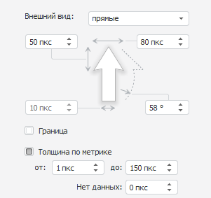
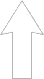
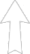
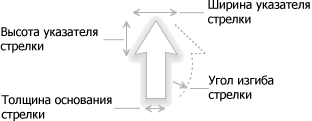
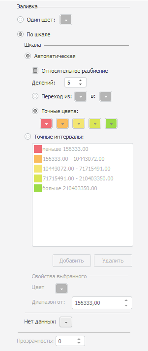

# Настройка параметров и заливки стрелок

Настройка параметров и заливки стрелок
-

# Настройка параметров и заливки стрелок

Для настройки параметров и заливки стрелок используйте вкладку «Стрелка» на боковой панели.

[Для отображения
 вкладки](javascript:TextPopup(this))

		- Убедитесь, что боковая панель отображается.

		- В рабочей области выделите карту, содержащую стрелки.

		- Установите на боковой панели переключатель «Формат»
		 и перейдите на вкладку «Стрелка».

Вкладка «Стрелка» разделена
 на группы, предназначенные для настройки различных параметров стрелки.

## Настройка внешнего вида стрелки

Для настройки внешнего вида стрелки используйте группу «Внешний
 вид»:

Задайте следующие параметры стрелки:

[Вид стрелки](javascript:TextPopup(this))

	Для выбора вида стрелки используйте раскрывающийся список «Внешний вид». Доступны следующие
	 виды стрелок:

		- Прямая. Стрелка
		 с прямым основанием, не меняющая свою ширину от основания к вершине:

	

		- Фигурная. Стрелка
		 с фигурным основание, изменяющая свою ширину от основания к вершине:

	

[Высота и толщина
 стрелки](javascript:TextPopup(this))

	Для указания высоты и толщины стрелки используйте соответствующие
	 поля:

	

	Диапазон допустимых значений для:

		- высоты указателя стрелок, ширины указателя стрелок, толщины
		 основания стрелки - [0, 100];

		- угла изгиба стрелки - [-89, 89].

	Примечание.
	 Параметр «Толщина основания стрелки»
	 доступен, если снят флажок «Толщина
	 по метрике».

	Для привязки толщины основания стрелки к значению метрики:

		- В [измерении метрик](../Common/Metrics.htm#metrics)
		 укажите элемент, определяющий параметр «Толщина
		 стрелок».

		- На вкладке «Стрелка»
		 установите флажок «Толщина по
		 метрике».

		- В поле «От» укажите
		 минимальную толщину основания стрелки, соответствующую минимальному
		 значению метрики. Минимально допустимое значение толщины основания
		 стрелки - «0».

		- В поле «До» укажите
		 максимальную толщину основания стрелки, соответствующую максимальную
		 значению метрики. Максимально допустимое значение толщины основания
		 стрелки - «150».

		- В поле «Нет данных»
		 укажите толщину основания стрелки в случае отсутствия данных.

[Граница стрелки](javascript:TextPopup(this))

	По умолчанию граница стрелки не отображается.

	Для отображения границы стрелки установите флажок «Граница»
	 и в соответствующих полях укажите следующие параметры линии границы:

		- цвет;

		- толщина;

		- тип линии.

	Для скрытия границы стрелки снимите флажок «Граница».

## Настройка заливки стрелки

Для настройки заливки стрелки используйте группу «Заливка»:

Для выбора способа заливки установите переключатель:

	- Один цвет. Все стрелки
	 заливаются одним цветом, указанном в соответствующей палитре цветов.
	 Для задания степени прозрачности стрелки используйте поле «Прозрачность»,
	 где «0» соответствует полной непрозрачности стрелки, а «100» - полной
	 прозрачности;

	- По шкале. Заливка стрелки
	 рассчитывается по цветовой шкале. Шкала задаёт набор числовых интервалов
	 и способ заливки для каждого интервала. Все параметры для настройки
	 заливки стрелки по цветовой шкале совпадают с параметрами [заливки
	 территорий карты](Color.htm) по цветовой шкале.

## Настройка подсветки стрелок

Для одновременной подсветки территории и стрелок, которые из неё выходят,
 установите флажок «Подсвечивать стрелки
 с территориями». Для подсветки только территорий снимите данный
 флажок.

См. также:

[Отображение стрелок](Arrows.htm)

		Справочная
		 система на версию 10.9
		 от 18/08/2025,
		 © ООО «ФОРСАЙТ»,
