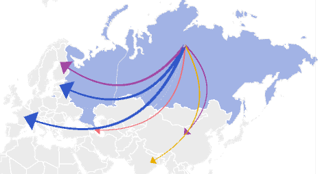

# Отображение стрелок

Отображение стрелок
-

# Отображение стрелок

Стрелка - это объект карты, привязанный к двум территориям: из которой
 начинается стрелка и в которую направляется стрелка. Стрелки позволяют
 визуализировать направление движения каких-либо потоков между территориями,
 например: экспорт или импорт товаров.

При наведении указателя мыши на стрелку отображается подсказка, содержащая
 наименования территории-источника, территории-приёмника стрелки и значения
 метрик, которые визуализирует стрелка.

Для отображения стрелок должны выполняться все требования, приведенные
 в разделе «[Требования для
 отображения стрелок](../Common/Arrows_requirements.htm)».

Примечание.
 Отображение стрелок недоступно в инструменте «Анализ
 временных рядов».

Пример стрелок на карте:

## Настройка стрелок

Для настройки:

	- общих параметров и заливки
	 стрелок используйте вкладку «[Стрелка](Arrow_Setup.htm)» на боковой панели;

	- подписей стрелок используйте
	 вкладку «Подписи стрелок»
	 на боковой панели. Все настройки подписей стрелок совпадают с настройками
	 [подсказок карты](Tooltips.htm);

	- легенды заливки стрелок
	 используйте вкладку «[Легенда
	 цвета стрелок](../Legend/SetupLegend.htm)» на боковой панели;

	- легенды размера стрелок
	 используйте вкладку «[Легенда
	 размера стрелок](../Legend/SetupLegend.htm)» на боковой панели. Настройки доступны,
	 если в [измерении метрик](../Common/Metrics.htm#metrics)
	 задан элемент, определяющий параметр «Толщина
	 стрелок».

См. также:

[Дополнительные
 возможности карты](Advanced_Features.htm) | [Требования
 для отображения стрелок](../Common/Arrows_requirements.htm)

		Справочная
		 система на версию 10.9
		 от 18/08/2025,
		 © ООО «ФОРСАЙТ»,
