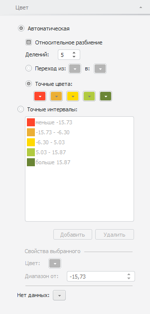

# Настройка заливки карты

Настройка заливки карты
-

# Настройка заливки карты

Для настройки заливки карты используйте вкладку «Цвет»
 на боковой панели.

Заливка карты рассчитывается по цветовой шкале. Шкала задаёт набор числовых
 интервалов и способ заливки для каждого интервала.

Примечание.
 При настройке шкалы учитывайте следующую особенность: граничные значения
 всегда входят в меньший интервал шкалы. Например, есть шкала с тремя интервалами:
 меньше 25, от 25 до 50, больше 50. Значение 25 будет входить в интервал
 «меньше 25», а значение 50 - в интервал «от 25 до 50».

[Для отображения
 вкладки](javascript:TextPopup(this))

		- Убедитесь, что боковая панель отображается.

		- В рабочей области выделите карту.

		- Установите на боковой панели переключатель «Формат»
		 и перейдите на вкладку «Цвет».

Задайте на вкладке следующие настройки заливки карты:

Для настройки заливки карты установите на вкладке один из переключателей:

[Автоматическая](javascript:TextPopup(this))

	При установке переключателя «Автоматическая»
	 интервалы шкалы рассчитываются автоматически. Задайте параметры расчёта:

		- Относительное разбиение.
		 Укажите, используется ли относительное разбиение шкалы.

		При установленном флажке диапазон разбивается на интервалы в зависимости
		 от выбранных в измерении элементов, интервалы могут быть не равными
		 по длине.

		При снятом флажке интервалы будут равными по длине и не будут зависеть
		 от выбранных в измерении элементов;

		- Делений. С помощью
		 редактора чисел или клавиатуры укажите количество интервалов:
		 от двух до десяти.

	Для определения способа заливки интервалов установите один из переключателей:

		- Переход. Цвета интервалов
		 будут определятся двухцветным градиентом. В раскрывающихся палитрах
		 укажите начальный и конечный цвета градиента;

		- Точные цвета. Цвет
		 каждого интервала укажите в раскрывающейся палитре. Количество
		 палитр совпадает с количеством интервалов.

[Точные интервалы](javascript:TextPopup(this))

	При установке переключателя «Точные
	 интервалы» интервалы задаются пользователем.

	С интервалами доступны следующие операции:

		- Добавление интервала.
		 Для добавления интервала нажмите кнопку «Добавить»;

		- Удаление интервала.
		 Для удаления выделенного интервала нажмите кнопку «Удалить».
		 Интервал будет удален, верхняя граница соседнего интервала будет
		 пересчитана;

		- Настройка цвета интервала.
		 В раскрывающейся палитре цветов укажите цвет для интервала;

		- Задание нижней границы
		 интервала. В редакторе чисел «Диапазон
		 от» укажите нижнюю границу интервала. Верхняя граница определяется
		 автоматически исходя из границ следующего интервала.

После выбора типа цветовой шкалы задайте следующую настройку:

[Нет данных](javascript:TextPopup(this))

	В раскрывающейся палитре «Нет данных»
	 укажите цвет для заливки фона объектов, данные для которых отсутствуют.

См. также:

[Настройка карты](MapConfigure.htm)

		Справочная
		 система на версию 10.9
		 от 18/08/2025,
		 © ООО «ФОРСАЙТ»,
