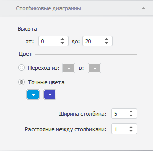
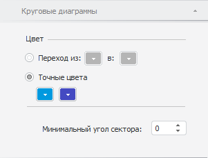

# Настройка общих параметров диаграмм

Настройка общих параметров диаграмм
-

# Настройка общих параметров диаграмм

Для настройки параметров столбиковых и круговых диаграмм используйте
 вкладки «Круговые диаграммы» и
 «Столбиковые диаграммы» на боковой
 панели.

## Параметры столбиковых диаграмм

[Для отображения
 вкладки «Столбиковые диаграммы»](javascript:TextPopup(this))

		- Убедитесь, что боковая панель отображается.

		- В рабочей области выделите карту, содержащую столбиковые
		 диаграммы.

		- Установите на боковой панели переключатель «Формат»
		 и перейдите на вкладку «Столбиковые
		 диаграммы».

Укажите следующие параметры диаграмм:

[Настройки столбиков
 диаграмм](javascript:TextPopup(this))

	Для настройки столбиков диаграммы используйте следующие параметры:

		- Высота. Укажите
		 диапазон высоты столбиков диаграммы. Минимальное и максимальное
		 значения высоты соответствуют минимальному и максимальному значениям
		 метрики, по которой построена диаграмма;

		- Ширина столбика.
		 Укажите ширину столбиков;

		- Расстояние между столбиками.
		 Укажите расстояние между столбиками на диаграмме.

[Цвет столбиков
 диаграмм](javascript:TextPopup(this))

	Для настройки цвета столбиков диаграммы используйте параметр «Цвет». Укажите способ определения
	 цвета столбиков:

		- Переход. Если переключатель
		 установлен, то цвета столбиков определяются двуцветным градиентом.
		 Укажите начальный и конечный цвета градиента в раскрывающихся
		 палитрах;

		- Точные цвета. Если
		 переключатель установлен, то цвета столбиков задаются пользователем.
		 Укажите цвета в раскрывающихся палитрах цветов. Количество палитр
		 совпадает с количеством элементов, отмеченных в [измерении
		 метрик](../Common/Metrics.htm#metrics) для построения столбиковых диаграмм.

## Параметры круговых диаграмм

[Для отображения
 вкладки «Круговые диаграммы»](javascript:TextPopup(this))

		- Убедитесь, что боковая панель отображается.

		- В рабочей области выделите карту, содержащую круговые диаграммы.

		- Установите на боковой панели переключатель «Формат»
		 и перейдите на вкладку «Круговые
		 диаграммы».

Укажите следующие параметры диаграмм:

[Настройки секторов
 диаграмм](javascript:TextPopup(this))

	Для секторов диаграммы задайте минимальный угол сектора в соответствующем
	 поле.

[Цвет секторов
 диаграмм](javascript:TextPopup(this))

	Для настройки цвета секторов диаграммы используйте параметр «Цвет». Укажите способ определения
	 цвета секторов:

		- Переход. Если переключатель
		 установлен, то цвета секторов определяются двуцветным градиентом.
		 Укажите начальный и конечный цвета градиента в раскрывающихся
		 палитрах;

		- Точные цвета. Если
		 переключатель установлен, то цвета секторов задаются пользователем.
		 Укажите цвета в раскрывающихся палитрах цветов. Количество палитр
		 совпадает с количеством элементов, отмеченных в [измерении
		 метрик](../Common/Metrics.htm#metrics) для построения круговых диаграмм.

См. также:

[Отображение диаграмм](Diagrams.htm)

		Справочная
		 система на версию 10.9
		 от 18/08/2025,
		 © ООО «ФОРСАЙТ»,
