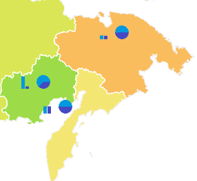

# Отображение диаграмм

Отображение диаграмм
-

# Отображение диаграмм

Диаграммы на карте позволяют отобразить дополнительную информацию о
 территориях.

При наведении указателя мыши на диаграмму может быть настроено отображение
 подсказки, содержащей различную информацию о метрике, к которой он привязан
 (например, название региона и значение какого-либо показателя).

Для отображения диаграмм настройте [измерение
 метрик](../Common/Metrics.htm#metrics). Сопоставьте элементы измерения и следующие параметры карты:

	- значения для построения столбиковых диаграмм. Установите переключатель
	 «Столбиковый» на вкладке измерения
	 и отметьте элементы, по значениям которых будут строиться столбиковые
	 диаграммы;

	- значения для построения круговых диаграмм. Установите переключатель
	 «Круговой» на вкладке измерения
	 и отметьте элементы, по значениям которых будут строиться круговые
	 диаграммы.

Примечание.
 Отображение диаграмм недоступно в инструменте «Анализ
 временных рядов».

Пример карты с круговыми и столбиковыми диаграммами:

## Настройка диаграмм

Для настройки:

	- общих параметров диаграмм
	 используйте вкладки «[Круговые
	 диаграммы](Diagram_Setup.htm#pie_chart)» и «[Столбиковые
	 диаграммы](Diagram_Setup.htm#bar_chart)» на боковой панели;

	- всплывающей подсказки диаграмм
	 используйте вкладку «Подсказки»
	 на боковой панели. Все настройки подсказок диаграмм совпадают с настройками
	 [подсказок карты](Tooltips.htm);

	- легенды диаграмм используйте
	 вкладки «[Легенда
	 круговых диаграмм](../Legend/SetupLegend.htm)» и «[Легенда столбиковых диаграмм](../Legend/SetupLegend.htm)»
	 на боковой панели.

См. также:

[Дополнительные возможности карты](Advanced_Features.htm)

		Справочная
		 система на версию 10.9
		 от 18/08/2025,
		 © ООО «ФОРСАЙТ»,
