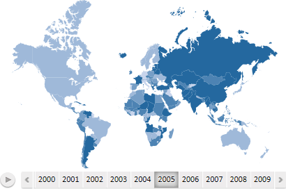
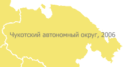
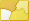
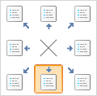
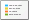

# Настройка карты

Настройка карты
-

# Настройка карты

[Работа
 с временной шкалой и анимацией](javascript:TextPopup(this))

	Примечание.
	 Возможность доступна, если в календарном измерении отмечено несколько
	 элементов.

	Временная шкала отражает динамику объектов наблюдения по заданным
	 метрикам в определенный промежуток времени. Деления на временной шкале
	 отображаются в виде дат, соответствующих отмеченным элементам календарного
	 измерения.

	Пример карты с временной шкалой:

	

	Для отображения на карте данных на определенную дату щелкните по
	 соответствующему делению временной шкалы.

	Если все деления временной шкалы не помещаются на карту, то отображаются
	 кнопки  и ,
	 предназначенные для прокрутки шкалы.

	При работе с временной шкалой доступна анимация:

		- для запуска анимации.
		 Нажмите кнопку . Во время
		 анимации изменяются заливка карты и высота территорий (если карта
		 отображается в режиме 3D);

		- для приостановки анимации.
		 Нажмите кнопку .

[Изменение
 масштаба карты](javascript:TextPopup(this))

	Примечание.
	 Возможность доступна для всех инструментов, кроме инструмента «Отчеты».

	Для изменения масштаба карты:

		- Убедитесь, что выбран источник данных.

		- Установите фокус на карте.

		- Наведите указатель мыши на карту.

		- Прокрутите колёсико мыши от себя для увеличения, к
		 себе - для уменьшения масштаба карты.

	Масштаб карты будет изменён. Масштаб остальных элементов останется
	 без изменения.

	Для возвращения карты к первоначальному масштабу:

		- в настольном приложении.
		 Нажмите кнопку  «Обновить», расположенную на
		 вкладке «Карта» ленты
		 инструментов, или нажмите клавишу F5;

		- в веб-приложении. Используйте
		 колесико мыши для приведения карты к первоначальному масштабу
		 или нажмите кнопку  «Обновить» на вкладке «Карта» [ленты инструментов](uiadhoc.chm::/launching.htm#elements_window).

[Панорамирование
 карты](javascript:TextPopup(this))

	Примечание.
	 Возможность доступна только в настольном приложении и для всех инструментов,
	 кроме инструмента «Отчеты».

	Панорамирование позволят переместить карту так, что интересующие
	 объекты окажутся в центре карты. Если масштаб карты увеличен и не
	 вся карта помещается на экране, то панорамирование позволяет переместить
	 требуемый фрагмент карты в видимую часть экрана.

	Для панорамирования карты:

		- Установите фокус на карте.

		- Зажмите клавишу SHIFT и правую кнопку мыши.

		- Перетащите карту в требуемую позицию.

	Положение карты будет изменено.

	Для возвращения карты к первоначальному положению нажмите кнопку
	  «Обновить»,
	 расположенную на вкладке «Карта»
	 ленты инструментов, или нажмите клавишу F5.

[Настройка
 заливки карты](javascript:TextPopup(this))

	Заливка карты выполняется по значениям элемента, отмеченного в [измерении метрик](../Common/Metrics.htm#metrics). Доступные
	 варианты заливки:

		- Быстрая заливка.
		 К карте применяется пятицветная заливка. Для выбора цветовой схемы
		 заливки используйте группу «Шаблоны
		 заливки» на вкладке «Карта»
		 ленты инструментов;

		- Заливка по параметрам пользователя.
		 Все параметры заливки задаются пользователем. Для настройки параметров
		 используйте вкладку «[Цвет](Color.htm)»
		 на боковой панели.

	Примечание.
	 Если карта отображается в режиме 3D, то заливка выполняется по значениям
	 элемента [измерении метрик](../Common/Metrics.htm#metrics),
	 определяющего цвет.

[Настройка
 всплывающих подсказок карты](javascript:TextPopup(this))

	Выплывающие подсказки предназначены
	 для отображения дополнительных сведений о территориях карты.

	Для отображения всплывающих подсказок установите флажок в заголовке
	 вкладки «[Подсказки](Tooltips.htm)»
	 на боковой панели. Для настройки текста и оформления подсказок используйте
	 эту же вкладку на боковой панели.

	По умолчанию отображение подсказок включено.

[Настройка
 подписей территорий карты](javascript:TextPopup(this))

	Подписи территорий предназначены
	 для постоянного отображения дополнительных сведений о территориях
	 карты. Например:

	

	Для отображения подписей территорий установите флажок в заголовке
	 вкладки «Подписи территорий»
	 на боковой панели. Для настройки текста и оформления подписей территорий
	 используйте эту же вкладку на боковой панели. Работа с вкладкой «Подписи территорий» аналогична работе
	 с вкладкой «[Подсказки](Tooltips.htm)».

	По умолчанию подписи территорий не отображаются.

[Изменение
 карты](javascript:TextPopup(this))

	Для изменения текущей карты:

		- нажмите кнопку 
		 «Изменить карту», расположенную
		 в группе «Вид» на вкладке
		 «Карта» ленты инструментов.
		 Будет открыт диалог для выбора карты из репозитория;

		- выполните команду «Изменить
		 карту» в контекстном меню карты. Будет открыт диалог для
		 выбора карты из репозитория;

		- используйте язык [Fore](Map.chm::/Interface/IMap/IMap.TopoBase.htm)
		 (только для настольного приложения).

	Для использования карты по умолчанию нажмите на нижнюю часть кнопки
	  «Изменить
	 карту», расположенную в группе «Вид»
	 на вкладке «Карта» ленты инструментов,
	 и выберите пункт «Вернуть карту по
	 умолчанию».

[Обновление
 карты](javascript:TextPopup(this))

	Для обновления визуализатора нажмите кнопку 
	 «Обновить», расположенную
	 на вкладке «Карта» ленты инструментов.

[Отображение
 вкладок боковой панели для настройки карты](javascript:TextPopup(this))

	Примечание.
	 Возможность доступна во всех инструментах, кроме инструмента «Отчеты».

	Для отображения вкладок боковой панели, предназначенных для настройки
	 карты, выполните команду контекстного меню «Настройки»/«Карта > Настройки».

[Настройка
 стиля карты](javascript:TextPopup(this))

	Для настройки карты используйте [стили карты](Map_style.htm).

## Настройка легенды

[Отображение/скрытие
 легенды](javascript:TextPopup(this))

	В зависимости от выбранных [метрик](UiSelection.chm::/Selection/Dimension_type.htm),
	 карта может иметь различные легенды:

		- легенда цвета;

		- легенда столбиковых диаграмм;

		- легенда круговых диаграмм;

		- легенда объема.

	Примечание.
	 «Легенда объема» доступна
	 при включенном режиме «[3D](MapConfigure.htm#3d)».

	Для отображения легенды карты выберите положение легенды на вкладке
	 боковой панели «Легенда цвета»,
	 «Легенда столбиковых диаграмм»,
	 «Легенда круговых диаграмм»
	 или «Легенда объема»:

	

	Для скрытия легенды нажмите кнопку выбора положения .

	Совет. Для быстрого
	 отображения/скрытия «Легенды цвета»
	 используйте раскрывающееся меню кнопки  «Легенда»,
	 расположенной в группе «Вид»
	 на вкладке «Карта» ленты инструментов.

[Настройка
 легенды](javascript:TextPopup(this))

	Для настройки:

		- расположения
		 легенды. Используйте раскрывающееся меню кнопки 
		 «Легенда»,
		 расположенной в группе «Вид»
		 на вкладке «Карта»
		 ленты инструментов;

	Примечание.
	 В веб-приложении кнопка «Легенда»
	 располагается в группе «Элементы»
	 на вкладке «Карта» ленты инструментов.

		- оформления
		 легенды. Используйте вкладку «[Легенда цвета](../Legend/SetupLegend.htm)» на
		 боковой панели.

	Подробнее см. раздел: «[Настройка
	 легенды](../Legend/SetupLegend.htm)».

## Настройка трехмерной карты

Работа с трехмерной картой недоступна для инструментов «Анализ
 временных рядов» и «Отчеты».

[Настройка
 трехмерной карты (3D режим)](javascript:TextPopup(this))

	Для настройки трехмерной карты:

		- Нажмите кнопку 
		 «3D», расположенную в
		 группе «Вид» на вкладке
		 «Карта» ленты инструментов.

	Примечание.
	 В веб-приложении кнопка «3D»
	 располагается в группе «Элементы»
	 на вкладке «Карта» ленты инструментов.

		- Настройте [измерение
		 метрик](../Common/Metrics.htm#metrics). Сопоставьте элементы измерения и следующие параметры
		 карты:

		-

			- Цвет заливки.
			 Установите переключатель «Цвет»
			 на вкладке измерения и отметьте элемент, по значениям которого
			 будет закрашиваться карта;

			- Высота элементов карты.
			 Установите переключатель «Объем»
			 на вкладке измерения и отметьте элемент, по значениям которого
			 будет определяться высота элементов карты.

	Примечание.
	 Для корректного отображения 3D-карты браузер должен поддерживать WebGL.

[Настройка
 объема карты](javascript:TextPopup(this))

	Примечание.
	 Возможность доступна, если в измерении метрик задан элемент, определяющий
	 высоту элементов карты.

	Для настройки параметров расчёта объема карты используйте вкладку
	 «[Объем](Panel_Height.htm)»
	 на боковой панели, для настройки параметров отображения легенды объема
	 - вкладку «[Легендой
	 объема](#showlegend)» на боковой панели.

[Вращение
 3D карты](javascript:TextPopup(this))

	Для вращения 3D карты:

		- Щёлкните по карте и зажмите кнопку мыши. При работе в настольном
		 приложении дополнительно зажмите клавишу SHIFT.

		- Перемещайте указатель в требуемую сторону.

	Карта будет повернута вслед за указателем мыши.

См. также:

[Приступая к работе](../Common/GettingStarted.htm)

		Справочная
		 система на версию 10.9
		 от 18/08/2025,
		 © ООО «ФОРСАЙТ»,
