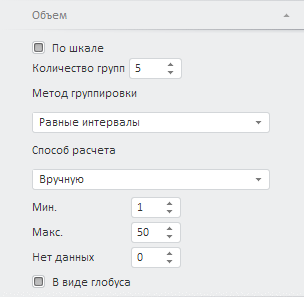
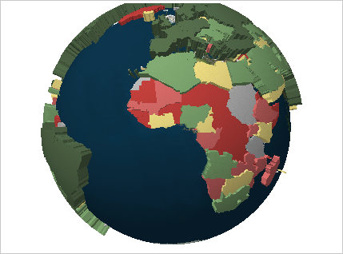

# Настройка объема карты

Настройка объема карты
-

# Настройка объема карты

Для настройки объема карты используйте вкладку «Объем»
 на боковой панели.

Вкладка боковой панели предназначена для настройки высоты элементов
 карты. Высота рассчитывается по шкале, определяющей набор числовых интервалов
 и высоту карты для каждого интервала.

Примечание.
 При настройке шкалы учитывайте следующую особенность: граничные значения
 всегда входят в меньший интервал шкалы. Например, есть шкала с тремя интервалами:
 меньше 25, от 25 до 50, больше 50. Значение 25 будет входить в интервал
 «меньше 25», а значение 50 - в интервал «от 25 до 50».

[Для отображения
 вкладки](javascript:TextPopup(this))

		- убедитесь, что боковая панель отображается;

		- в рабочей области выделите карту, для которой включен [режим 3D](MapConfigure.htm#3d) и задан индикатор объема;

		- установите на боковой панели переключатель «Формат»
		 и перейдите на вкладку «Объем».

Флажок «По шкале» определяет
 метод расчёта шкалы высот. Если флажок снят, то шкала настраивается автоматически;
 если установлен, то параметры расчёта шкалы задаются пользователем.

Параметры расчёта шкалы высот:

	- Количество групп. Задайте
	 количество интервалов шкалы: от двух до десяти;

	- Метод группировки. Выберите
	 метод расчёта интервалов шкалы:

	-

		- равные интервалы.
		 Весь диапазон исходных данных разбивается на заданное количество
		 равных интервалов. Количество значений в исходных данных, попадающих
		 в интервал, не учитывается;

		- относительное разбиение.
		 Весь диапазон исходных данных разбивается на заданное количество
		 интервалов таким образом, чтобы каждый интервал содержал равное
		 количество значений из исходных данных, попадающих в интервал.
		 Длина интервалов не учитывается;

	- Способ расчета. Укажите
	 способ расчёта минимальной и максимальной высот:

		- авто. Значения минимальной
		 и минимальной высот определяются автоматически;

		- вручную. Параметры
		 расчёта высоты задаются пользователем. Диапазон допустимых значений:
		 [1, 100]. Используете поля:

			- Мин. Минимальное
			 значение высоты;

			- Макс. Максимальное
			 значение высоты;

			- Нет данных.
			 Укажите высоту, которая будет использоваться для регионов,
			 данные для которых отсутствуют.

На основании этих значений будут рассчитаны
 интервалы шкалы;

	- В
	 виде глобуса. Если флажок установлен, то доступно отображение
	 трехмерной карты в виде глобуса. Для вращения глобуса используйте
	 указатель мыши.

Примечание.
 Возможность доступна только в веб-приложении. Для корректного отображения
 используемая карта должна быть [сконвертирована](../Common/Topobase.htm#convertmap).

Пример карты в виде глобуса:

См. также:

[Настройка карты](MapConfigure.htm)

		Справочная
		 система на версию 10.9
		 от 18/08/2025,
		 © ООО «ФОРСАЙТ»,
