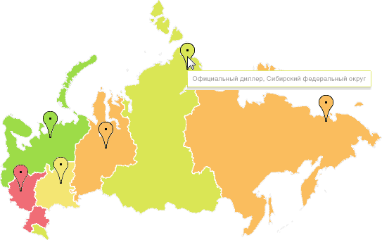

# Отображение маркеров геолокации

Отображение маркеров геолокации
-

# Отображение маркеров геолокации

Маркер геолокации - это точка, привязанная к территории. Маркеры позволяют
 отображать на карте места, необходимые пользователю, например: расположение
 магазинов или станций метро.

При наведении указателя мыши на маркер может быть настроено отображение
 подсказки, содержащей различную информацию о точке, к которой он привязан
 (например, название организации).

Для отображения маркеров должны выполняться все требования, приведенные
 в разделе «[Требования для
 отображения маркеров геолокации](../Common/Markers_requirements.htm)».

Примечание.
 Отображение маркеров геолокации недоступно в инструменте «Анализ
 временных рядов».

Пример карты с настроенными маркерами геолокации:

## Настройка маркеров геолокации

Для настройки:

	- всплывающей подсказки маркеров
	 используйте вкладку «Подсказки»
	 на боковой панели. Все настройки подсказок маркеров совпадают с настройками
	 [подсказок карты](Tooltips.htm);

	- заливки маркеров используйте
	 вкладку «Маркеры» на боковой
	 панели. Все настройки заливки маркеров совпадают с настройками [заливки карты](Color.htm);

	- легенды заливки маркеров
	 используйте вкладку «[Легенда
	 маркеров](../Legend/SetupLegend.htm)» на боковой панели.

См. также:

[Дополнительные
 возможности карты](Advanced_Features.htm) | [Требования
 для отображения маркеров геолокации](../Common/Markers_requirements.htm)

		Справочная
		 система на версию 10.9
		 от 18/08/2025,
		 © ООО «ФОРСАЙТ»,
