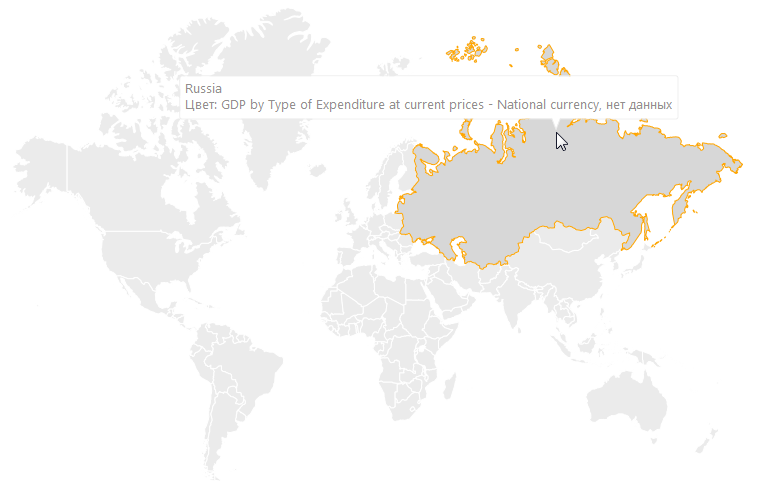
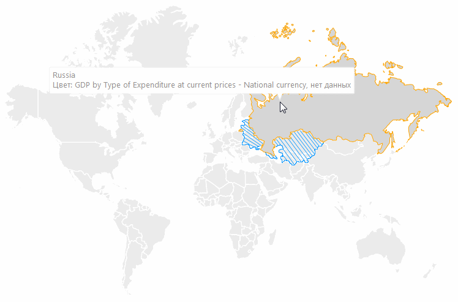

# Отображение версионной карты

Отображение версионной карты
-

# Отображение версионной карты

Версионная карта отображает изменение границ территорий во времени.
 Например, разделение одной страны на несколько новых государств или изменение
 границ субъектов в рамках одной страны.

Версия карты изменяется автоматически в зависимости от года, на который
 отображается информация.

Для отображения версионной карты должны выполняться все требования,
 приведенные в разделе «[Требования
 для отображения версионной карты](../Common/Version_requirements.htm)».

Примечание.
 Отображение версионной карты недоступно в инструменте «Анализ
 временных рядов».

Примеры версионной карты:

	- 1990 год:

	- 1991 год. Заштрихованная область соответствует изменившейся территории:

См. также:

[Дополнительные возможности карты](Advanced_Features.htm)
 | [Требования для отображения
 версионной карты](../Common/Version_requirements.htm)

		Справочная
		 система на версию 10.9
		 от 18/08/2025,
		 © ООО «ФОРСАЙТ»,
