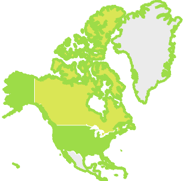
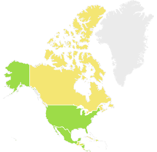

# Отображение контуров территорий

Отображение контуров территорий
-

# Отображение контуров территорий

Контур территории позволяет отображать на карте границы родительской
 территории при отметке нескольких дочерних элементов территориального
 измерения.

Для отображения контуров территорий должны выполняться все требования,
 приведенные в разделе «[Требования
 для отображения контуров территорий](../Common/Loop_requirements.htm)».

Примечание.
 Отображение контуров территорий недоступно в инструменте «Анализ
 временных рядов».

Для отображения контуров территорий:

	- Отметьте один или несколько элементов одного уровня территориального
	 измерения.

	- Отметьте один или несколько дочерних элементов, для уже отмеченных
	 элементов.

На карте будет отображены контуры территорий согласно отметке, сделанной
 в территориальном измерении.

Например, в территориальном измерении отмечен элемент «Северная Америка»
 и его дочерние элементы:

	- карта с контурами территорий:

	- карта без контуров территорий:

См. также:

[Настройка
 карты](MapConfigure.htm) | [Дополнительные возможности
 карты](Advanced_Features.htm)

		Справочная
		 система на версию 10.9
		 от 18/08/2025,
		 © ООО «ФОРСАЙТ»,
