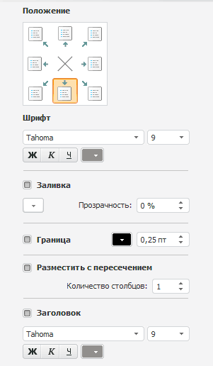
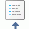
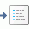
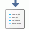

# Настройка легенды

Настройка легенды
-

# Настройка легенды

Для настройки легенды используйте вкладку, расположенную в группе вкладок
 «Формат» на боковой панели. Название
 вкладки зависит от настраиваемой легенды. Доступны следующие виды
 легенд:

	- легенда цвета. Предназначена
	 для обозначения значений метрики, по которым [закрашиваются
	 территории](../Configure/Color.htm) карты;

	- легенда столбиковых диаграмм.
	 Предназначена для обозначения значений метрики, по которым закрашиваются
	 [столбиковые диаграммы](../Configure/Diagrams.htm) на карте;

	- легенда круговых диаграмм.
	 Предназначена для обозначения значений метрики, по которым закрашиваются
	 [круговые диаграммы](../Configure/Diagrams.htm) на карте;

	- легенда объема. Предназначена
	 для обозначения значений метрики, по которым определяется [высота
	 территорий](../Configure/Panel_Height.htm) на карте в 3D-режиме;

	- легенда маркеров. Предназначена
	 для обозначения значений метрики, по которым определяется цвет [маркеров геолокации](../Configure/coordinate_marker.htm);

	- легенда цвета стрелок.
	 Предназначена для обозначения значений метрики, по которым определяется
	 цвет [стрелок](../Configure/Arrows.htm);

	- легенда размера стрелок.
	 Предназначена для обозначения значений метрики, по которым определяется
	 размер [стрелок](../Configure/Arrows.htm).

[Для отображения
 вкладки настройки легенд](javascript:TextPopup(this))

		- Убедитесь, что [боковая
		 панель](GetStarted.chm::/Interface/Interface_Description.htm#side_panel) и легенда карты отображаются.

		- В рабочей области выделите карту.

		- Установите на боковой панели переключатель «Формат»
		 и перейдите на вкладку, соответствующую настраиваемой легенде.

На вкладке доступны следующие настройки легенды:

[Расположение
 легенды](javascript:TextPopup(this))

	В группе «Положение» выберите
	 положение легенды относительно карты:

		- . В левом верхнем
		 углу;

		- . По центру верхней
		 границы;

		- . В правом верхнем
		 углу;

		- . По центру правой
		 границы;

		- . В правом нижнем
		 углу;

		- . По центру нижней
		 границы;

		- . В левом нижнему
		 углу;

		- . По центру левой
		 границы;

		- . Легенда не отображается.

	По умолчанию легенда отображается по центру нижней границы карты.

[Настройка параметров
 шрифта](javascript:TextPopup(this))

	Настройте параметры шрифта, используемого в легенде:

		- Шрифт.
		 Выберите один из шрифтов, установленных в операционной системе;

		- Размер
		 шрифта. Установите требуемый размер шрифта. Размер задаётся
		 в пунктах, и его можно выбрать из раскрывающегося списка или ввести
		 вручную. Диапазон допустимых значений: [1, 72];

		- Начертание
		 текста. Нажмите кнопки, задающие начертание шрифта:

			- Ж. Полужирное
			 начертание;

			- К.
			 Курсивное начертание;

			- Ч.
			 Подчеркивание текста.

	При нажатой кнопке будет использоваться
	 соответствующий стиль начертания. Доступно использование нескольких
	 стилей одновременно, например, нажатие кнопок «Ж»
	 и «К»
	 даёт полужирное курсивное начертание;

		- Цвет шрифта. Выберите
		 цвет шрифта в раскрывающейся палитре цветов.

[Настройка заливки
 легенды](javascript:TextPopup(this))

	Для заливки фона легенды установите флажок «Заливка»
	 и в соответствующих полях задайте цвет и прозрачность заливки.

[Настройка границы
 легенды](javascript:TextPopup(this))

	Для отображения границы легенды установите флажок «Граница».
	 В соответствующих полях укажите цвет и толщину линии границы.

[Настройка размещения
 легенды](javascript:TextPopup(this))

	Для размещения легенды с пересечением карты установите флажок «Размещать с пересечением». После
	 установки флажка укажите количество столбцов в легенде.

	Примечание.
	 Для легенды объема и легенды размера стрелок недоступна настройка
	 количества столбцов в легенде.

	При снятом флажке карта не пересекается с легендой, количество столбцов
	 в легенде определяется автоматически.

[Настройка заголовка
 легенды](javascript:TextPopup(this))

	Для отображения заголовка легенды установите флажок «Заголовок»
	 и задайте параметры шрифта.

	Параметры шрифта заголовка легенды совпадают с параметрами шрифта,
	 используемого в легенде.

	Примечание.
	 Для легенд столбиковых и круговых диаграмм в качестве заголовка используются
	 названия диаграмм.

См. также:

[Настройка карты](../Configure/MapConfigure.htm)

		Справочная
		 система на версию 10.9
		 от 18/08/2025,
		 © ООО «ФОРСАЙТ»,
