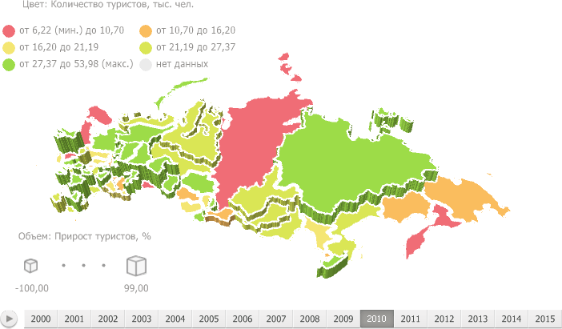

# Карта

Карта
-

# Карта

Карта используется в различных инструментах продукта «Форсайт. Аналитическая платформа»:
 «Аналитические запросы (OLAP)»,
 «Отчеты», «Анализ
 временных рядов», «Аналитические
 панели».

Ключевые возможности:

	- подключение внешних картографических сервисов;

	- детализация и обобщение данных;

	- использование маркеров геолокации, стрелок, круговых и столбиковых
	 диаграмм;

	- настройка всплывающих подсказок, легенды;

	- 3D режим карты;

	- настройка стиля карты и отображения контуров территорий.

Для получения подробной информации
 обратитесь к разделам: «[Приступая
 к работе](Common/GettingStarted.htm)», «[Настройка измерений для работы
 с картой](Common/Metrics.htm)», «[Настройка карты](Configure/MapConfigure.htm)»,
 «[Дополнительные возможности
 карты](Configure/Advanced_Features.htm)».

Важно. Перед
 работой с визуализатором убедитесь в соблюдении системных требований к
 [клиентскому
 компьютеру](Setup.chm::/03_DB_Server_Config/Setup_DB_ServerSysReq.htm#client) для настольного приложения и к [BI-серверу](Setup.chm::/03_DB_Server_Config/Setup_DB_ServerSysReq.htm#bi)
 для веб-приложения. В веб-приложении поддержка визуализаторов осуществляется,
 если BI-сервер установлен на ОС Windows 7 и выше. Внешний вид визуализатора
 может отличаться в зависимости от используемых графических библиотек DirectX
 11 или OpenGL 3.1.

См. также:

[Приступая
 к работе](Common/GettingStarted.htm)

		Справочная
		 система на версию 10.9
		 от 18/08/2025,
		 © ООО «ФОРСАЙТ»,
