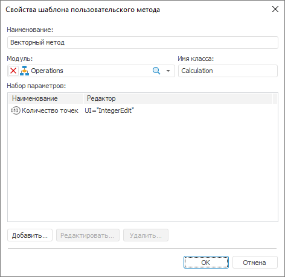

# Свойства шаблона пользовательского метода

Свойства шаблона пользовательского метода
-

# Свойства шаблона пользовательского метода

Окно предназначено для редактирования параметров шаблона [пользовательского
 метода](../2_3_Work_object/2_3_2_Model/Specification/UiModelling_SpecificationUserMethod.htm) расчета:

Укажите необходимые параметры:

	- Наименование. Наименование
	 шаблона, отображаемое в дереве методов расчёта на панели «[Параметры](../2_3_Work_object/2_3_2_Model/Standart_Model/UiModelling_Panel_Param_Attr.htm)»;

	- Модуль. Модуль, в котором
	 содержится пользовательский метод расчёта;

	- Имя класса. Имя класса,
	 реализующего пользовательский метод расчёта. Для работы такого
	 метода в классе должна иметься реализация метода [IMsUserTransformImplementation.Execute](KeMs.chm::/Interface/IMsUserTransformImplementation/IMsUserTransformImplementation.Execute.htm);

	- Набор параметров. Список
	 предназначен для работы с параметрами пользовательского метода расчёта.

[Для добавления
 параметра](javascript:TextPopup(this))

		- нажмите кнопку «Добавить»;

		- выполните одноименную команду контекстного меню;

		- нажмите клавишу INSERT.

	Будет открыто окно «Редактирование
	 параметра», в котором укажите наименование параметра и тип
	 редактора значений параметра. Для настройки редактора значений нажмите
	 кнопку «Настроить». Подробнее
	 см. раздел: «[Параметры редактора значений](UiNav.Chm::/GUI/ValueEditorParameters.htm)».

[Для редактирования
 выбранного параметра](javascript:TextPopup(this))

		- нажмите кнопку «Редактировать»;

		- выполните одноименную команду контекстного меню;

		- дважды щёлкните по параметру.

	Будет открыто окно «Редактирование
	 параметра».

[Для удаления
 выбранных параметров](javascript:TextPopup(this))

		- нажмите кнопку «Удалить»;

		- выполните одноименную команду контекстного меню;

		- нажмите клавишу DELETE.

	Будет запрошено подтверждение удаления.

См. также:

[Мастер
 создания контейнера моделирования](UiModelling_Create_Container.htm) | [Пользовательские
 методы](../2_3_Work_object/2_3_2_Model/Specification/UiModelling_SpecificationUserMethod.htm)

		Справочная
		 система на версию 10.9
		 от 18/08/2025,
		 © ООО «ФОРСАЙТ»,
