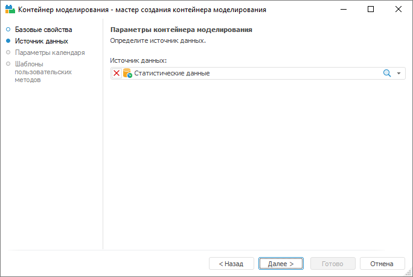
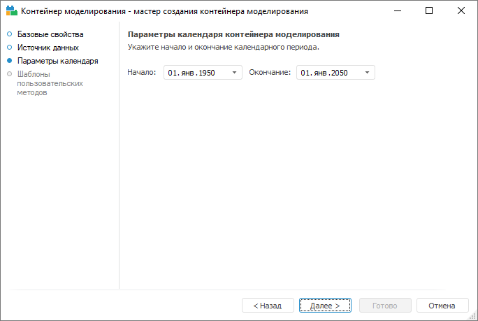
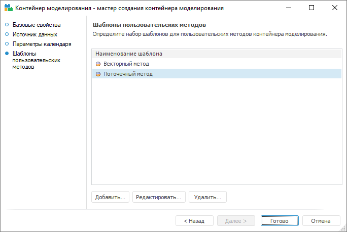

# Создание контейнера моделирования

Создание контейнера моделирования
-

# Создание контейнера моделирования

Контейнер моделирования создается из окна навигатора объектов. Для создания
 контейнера моделирования:

	- выполните команду контекстного меню «Создать
	 > Контейнер моделирования»;

	- выполните команду главного меню «Объект
	 > Создать > Контейнер моделирования».

Будет открыт «Мастер создания контейнера
 моделирования».

Примечание.
 Создание контейнера моделирования с помощью мастера доступно только в
 настольном приложении.

## Страница «Источник данных»

Укажите базу данных, стандартный куб или базу данных временных рядов,
 в которой будут храниться все данные контейнера моделирования.

Примечание.
 С помощью внутреннего языка Fore в качестве источника данных можно использовать
 виртуальный куб или представление-куб.

## Страница «Параметры календаря»

Укажите даты начала и окончания календаря контейнера моделирования.

Дата начала календаря - это минимально-возможная дата начала периода
 идентификации. Дата окончания - максимально-возможная дата окончания периода
 прогнозирования.

## Страница «Шаблоны пользовательских методов»

Страница предназначена для работы с шаблонами пользовательских методов,
 применяемых в контейнере моделирования.

Редактирование шаблона производится в окне «[Свойства
 шаблона пользовательского метода](UiMd_Container_Modelling_Master_templateProperty.htm)».

[Для добавления
 шаблона](javascript:TextPopup(this))

		- нажмите кнопку «Добавить»;

		- выполните одноименную команду контекстного меню;

		- нажмите клавишу INSERT.

[Для редактирования
 выбранного шаблона](javascript:TextPopup(this))

		- нажмите кнопку «Редактировать»;

		- выполните одноименную команду контекстного меню;

		- дважды щёлкните по шаблону.

[Для удаления
 выбранных шаблонов](javascript:TextPopup(this))

		- нажмите кнопку «Удалить»;

		- выполните одноименную команду контекстного меню;

		- нажмите клавишу DELETE.

	Будет запрошено подтверждение удаления.

См. также:

Настольное приложение: [описание
 интерфейса](../2_2_Window_container/UiModelling_Window_container.htm)

		Справочная
		 система на версию 10.9
		 от 18/08/2025,
		 © ООО «ФОРСАЙТ»,
