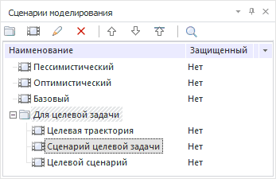
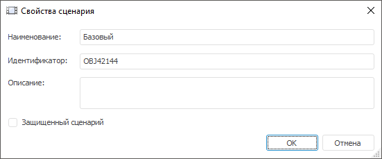

# Панель сценариев моделирования

Панель сценариев моделирования
-

# Панель сценариев моделирования

Панель «Сценарии моделирования»
 предназначена для работы со сценариями, по которым рассчитываются [задачи
 моделирования](../2_3_Work_object/2_3_4_Problem/uimodelling_problem.htm). На данной панели отображаются только сценарии, на которые
 у пользователя есть право на чтение.

По умолчанию панель отображается. Для закрытия панели нажмите кнопку
 «x» в правом верхнем углу панели
 или снимите флажок «Сценарии моделирования»
 в главном меню «Вид». Для отображения
 панели установите флажок «Сценарии моделирования»
 в главном меню «Вид».

Редактирование параметров сценария производится в окне «Свойства
 сценария»:

Окно содержит параметры:

	- Наименование. Наименование
	 сценария, несущее смысловую нагрузку;

	- Идентификатор. Уникальный
	 идентификатор объекта. Идентификатор должен начинаться с буквы;

	- Описание. Комментарий
	 к сценарию;

	- Защищенный сценарий.
	 Установка флажка запрещает внесение изменений по данному сценарию.
	 По умолчанию флажок снят.

[Для создания
 сценария](javascript:TextPopup(this))

		- нажмите кнопку  на панели инструментов;

		- выполните команду «Создать
		 сценарий» в контекстном меню папки.

[Для создания
 папки](javascript:TextPopup(this))

		- нажмите кнопку  на панели инструментов;

		- выполните команду «Создать
		 папку» контекстном меню папки.

[Для редактирования
 сценария](javascript:TextPopup(this))

		- нажмите кнопку  на панели инструментов;

		- выполните команду «Редактировать»
		 в контекстном меню сценария;

		- дважды щёлкните по сценарию.

[Для переименования
 выбранного сценария/папки](javascript:TextPopup(this))

		- выполните команду «Переименовать»
		 в контекстном меню объекта;

		- дважды щёлкните по объекту;

		- нажмите клавишу F2.

[Для удаления
 выбранных сценариев/папок](javascript:TextPopup(this))

		- нажмите кнопку  на панели инструментов;

		- выполните команду «Удалить»
		 в контекстном меню объекта;

		- нажмите клавишу DELETE.

	Будет запрошено подтверждение выполняемого действия. Объекты удаляются
	 вместе с дочерними элементами.

[Для изменения
 порядка следования сценариев/папок](javascript:TextPopup(this))

		- перетащите объект в требуемую позицию;

		- используйте кнопки , ,
		 
		 на панели инструментов;

		- используйте команды «Переместить
		 вверх», «Переместить вниз»,
		 «Переместить на уровень вверх»
		 в контекстном меню объекта.

	Объекты перемещаются вместе с дочерними элементами.

[Поиск папки/сценария](javascript:TextPopup(this))

	Поиск выполняется по наименованию объекта. Для выполнения поиска
	 нажмите кнопку  на панели инструментов. Будет
	 открыт диалог, в котором укажите наименование или часть наименования
	 искомого элемента.

См. также:

[Объект
 «Задача»](../2_3_Work_object/2_3_4_Problem/uimodelling_problem.htm) | [Сценарии](../2_3_Work_object/2_3_4_Problem/uimodelling_problem_3.htm)

		Справочная
		 система на версию 10.9
		 от 18/08/2025,
		 © ООО «ФОРСАЙТ»,
