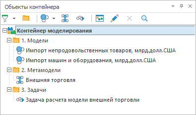

# Панель объектов контейнера

Панель объектов контейнера
-

# Панель объектов контейнера

Панель «Объекты контейнера»
 отображает древовидную структуру объектов, содержащихся в текущем контейнере:

По умолчанию панель отображается. Для закрытия панели нажмите кнопку
 «x» в правом верхнем углу панели
 или снимите флажок «Дерево объектов»
 в главном меню «Вид». Для отображения
 панели установите флажок «Дерево объектов»
 в главном меню «Вид».

Панель «Объекты контейнера»
 позволяет управлять внешним видом древовидного списка объектов. В контекстном
 меню панели установите необходимые флажки:

	- Отображать наименования.
	 Отображаются только наименования объектов;

	- Отображать идентификаторы.
	 Отображаются только идентификаторы объектов;

	- Отображать наименования и идентификаторы.
	 Отображаются как наименования, так и идентификаторы объектов;

	- Отображать всплывающую подсказку.
	 При наведении курсора на объект отображается всплывающая подсказка,
	 содержащая следующую информацию: наименование, идентификатор, дата
	 изменения и тип объекта;

	- Отображать пустые папки.
	 В списке объектов отображаются папки, не содержащие объектов.

В дереве объектов реализована фильтрация по типу объектов. Используйте
 кнопку .
 Щелкните  и отметьте флажками
 типы объектов, которые должны отображаться в дереве. Для применения фильтрации
 нажмите кнопку .
 При включенной фильтрации кнопка подсвечена:

	- .
	 Фильтрация объектов включена;

	- .
	 Фильтрация объектов выключена.

См. также:

Настольное приложение: [описание
 интерфейса](UiModelling_Window_container.htm)

		Справочная
		 система на версию 10.9
		 от 18/08/2025,
		 © ООО «ФОРСАЙТ»,
