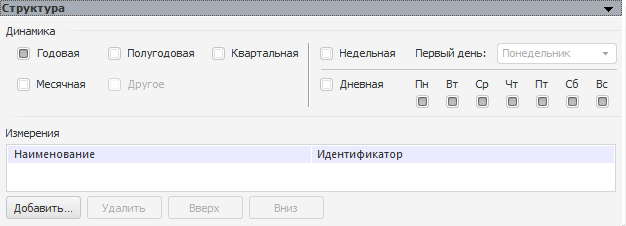

# Структура

Структура
-

# Структура

Панель предназначена для настройки календарной динамики переменной и
 работы с измерениями в её структуре:

	- Динамика. Отметьте флажками
	 календарные динамики, которые должны присутствовать в переменной:

	-

		- Годовая;

		- Полугодовая;

		- Квартальная;

		- Месячная;

		- Недельная. Если
		 динамика отмечена, то доступна настройка параметров недели:

		-

			- Первый день.
			 Укажите первый день недели, по умолчанию «Понедельник»;

		- Дневная. Если динамика
		 отмечена, то доступен выбор дней, для которых переменная содержит
		 данные. Отметьте флажками требуемые дни;

		- Другое.
		 Находится в разработке.

Если выбрано несколько уровней динамики,
 то на панели «[Агрегация](UiModelling_Work_object_Value_3.htm)»
 автоматически появляется календарное измерение, по уровням которого будет
 настраиваться агрегация.

	- Измерения. Добавьте
	 дополнительные измерения, в элементах которых будут содержаться данные.
	 В качестве измерения можно указать справочник или справочник НСИ.
	 Если измерение имеет несколько динамик, то для него доступна настройка
	 [агрегации](UiModelling_Work_object_Value_3.htm).

См. также:

[Объект «Переменная»](uimodelling_work_object_value.htm)
 | [Способ
 наполнения данными](UiModelling_Work_object_Value_4.htm)

		Справочная
		 система на версию 10.9
		 от 18/08/2025,
		 © ООО «ФОРСАЙТ»,
