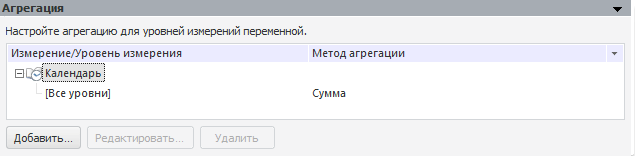
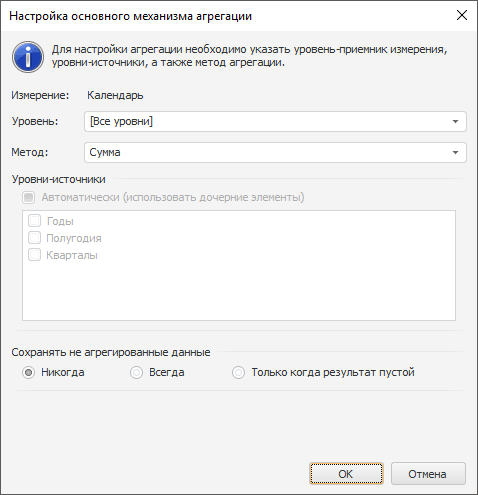
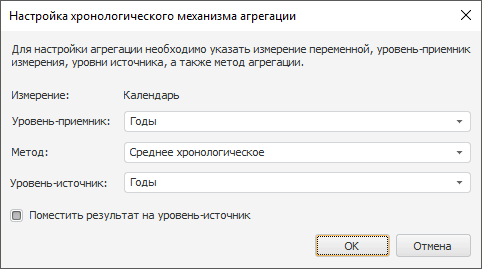
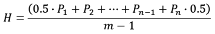

# Агрегация (переменная)

Агрегация (переменная)
-

# Агрегация

Панель предназначена для настройки агрегации по уровням измерений переменной.
 Агрегация позволяет проводить вычисление значений на более высоких уровнях
 в зависимости от значений на более низких уровнях.

Пример панели «Агрегация» приведён
 на рисунке:

На панели «Агрегация» отображаются
 все измерения переменной, содержащие более одного уровня. Настройки агрегации
 для уровней измерения отображаются в виде дочерних элементов измерения.
 Для каждого настроенного уровня отображается метод агрегации.

Редактирование агрегации осуществляется в окне «Настройка
 основного механизма агрегации» или «Настройка
 хронологического механизма агрегации».

## Настройка основного механизма агрегации

Основной механизм агрегации может применяться для всех измерений. Редактирование
 агрегации осуществляется в окне:

Задайте параметры:

	- Уровень. Из раскрывающегося
	 списка выберите уровень измерения, для которого настраивается агрегация.
	 Список также содержит пункт «[Все
	 уровни]», при выборе которого агрегация настраивается единообразно
	 для всех уровней измерения. Таким образом, если в измерение, которое
	 является измерением переменной, был добавлен новый уровень, то для
	 него автоматически будет применена и рассчитана агрегация.

	При редактировании агрегации раскрывающийся список «Уровень»
	 недоступен и отображает редактируемый уровень;

	- Метод. Укажите метод,
	 используемый для агрегации. Доступные методы:

	-

		- Сумма. Суммируются
		 элементы уровня-источника;

		- Минимум. На уровне-источнике
		 выбирается минимальное значение;

		- Максимум. На уровне-источнике
		 выбирается максимальное значение;

		- Количество непустых.
		 Определяется количество непустых значений на уровне-источнике;

		- Количество пустых.
		 Определяется количество пустых значений на уровне-источнике;

		- Количество всех дочерних.
		 Определяется количество дочерних элементов на уровне-источнике;

		- Арифметическое среднее.
		 Определяется [среднее значение](Lib.chm::/05_Statistics/UiModelling_Avg.htm) элементов уровня-источника с учетом
		 пустых значений;

		- Фактическое среднее.
		 Определяется [среднее значение](Lib.chm::/05_Statistics/UiModelling_Avg.htm) элементов уровня-источника без учета
		 пустых значений;

		- Первое фактическое.
		 На уровне-источнике берется первое имеющееся (фактическое) значение;

		- Последнее фактическое.
		 На уровне-источнике берется последнее имеющееся (фактическое)
		 значение;

		- Среднеквадратическое отклонение
		 по выборке. Определяется [среднеквадратическое
		 отклонение](Lib.chm::/05_Statistics/UiModelling_ArgSqDev.htm) ряда по выборке;

		- Медиана. Определяется
		 [медиана](Lib.chm::/05_Statistics/UiModelling_Median.htm)
		 для значений на уровне-источнике;

		- Среднеквадратическое отклонение.
		 Определяется [среднеквадратическое
		 отклонение](Lib.chm::/05_Statistics/UiModelling_ArgSqDev.htm) ряда по генеральной совокупности;

		- Количество различных значений.
		 Определяется количество различных значений на уровне-источнике;

	- Уровни-источники. Отметьте
	 флажками уровни измерения, данные которых будут использоваться при
	 агрегации. Установка флажка «Автоматически
	 (использовать дочерние элементы)» позволяет использовать при
	 агрегации все элементы, расположенные на уровень ниже. Если в раскрывающемся
	 списке «Уровень» выбран пункт
	 «[Все уровни]», то флажок
	 «Автоматически (использовать дочерние
	 элементы)» устанавливается автоматически, а группа «Уровни-источники»
	 будет недоступна;

	- Сохранять неагрегированные
	 данные. Группа содержит переключатели, определяющие параметры
	 сохранения неагрегированных данных:

	-

		- Никогда. Агрегированные
		 данные всегда будут записаны на уровень-приёмник. Таким образом,
		 неагрегированные данные будут перетёрты;

		- Всегда. Агрегированные
		 данные будут записаны на уровень-приёмник, если на уровне-приёмнике
		 отсутствуют данные. Таким образом, неагрегированные данные будут
		 сохранены;

		- Только когда результат
		 пустой. Агрегированные данные будут записаны на уровень-приёмник,
		 только если результат агрегации пустой. Таким образом, неагрегированные
		 данные будут сохранены.

Если измерение уже содержит агрегацию по различным уровням, а в данном
 окне была произведена настройка агрегации для всех уровней, то будет запрошено
 подтверждение замены метода агрегации.

## Выбор механизма агрегации для календарного
 измерения

Для календарного измерения переменной доступен выбор механизма агрегации.
 Для выбора механизма используйте контекстное меню календарного измерения.

По умолчанию используется основной механизм агрегации, настройка которого
 описана выше. Вид окна при выборе хронологического механизма агрегации:

В качестве параметров укажите: уровень-приёмник, уровень-источник, а
 также метод, используемый для агрегации. Доступны следующие методы:

	- Среднее хронологическое.
	 Результат рассчитывается по формуле:

Где:

	-

		- H.
		 Хронологическое среднее ряда;

		- n.
		 Количество точек (дней, месяцев и т.д.) ряда, участвующих в расчете;

		- m.
		 Количество точек (дней, месяцев и т.д.) ряда, в которых есть данные;

		- P1. Значение
		 ряда на начало периода, за который считается хронологическое среднее;

		- Pn.
		 Значение ряда на конец периода, за который считается хронологическое
		 среднее.

Если в точках P1 и Pn отсутствуют
 данные, то на коэффициент 0,5 умножается значение в ближайшей точке с
 имеющимися данными к P1
 и Pn
 соответственно.

Хронологическое среднее значение может быть
 рассчитано в рамках месяца (уровень-источник дни), в рамках квартала (уровень-источник
 дни, месяцы), в рамках года (уровень-источник дни, месяцы или кварталы).

По умолчанию результаты агрегации выгружаются
 на уровень-приёмник и уровень-источник. Для выгрузки результатов только
 уровень-приёмник снимите флажок «Поместить
 результат на уровень-источник»;

	- Равномерная дезагрегация.
	 При использовании данного метода значение элемента уровня-источника
	 делится на количество элементов уровня-приёмника. При использовании
	 данного метода следует выбирать в качестве уровня-источника - уровень-родитель,
	 а в качестве уровня-приёмника - дочерний уровень. Например, равномерная
	 дезагрегация может быть рассчитана в рамках дня (уровень-источник
	 месяцы, кварталы или годы), в рамках месяца (уровень-источник годы,
	 кварталы), в рамках квартала (уровень-источник годы).

См. также:

[Объект «Переменная»](uimodelling_work_object_value.htm)
 | [Способ
 наполнения данными](UiModelling_Work_object_Value_4.htm)

		Справочная
		 система на версию 10.9
		 от 18/08/2025,
		 © ООО «ФОРСАЙТ»,
