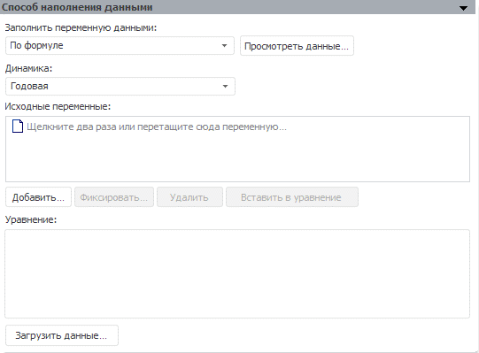
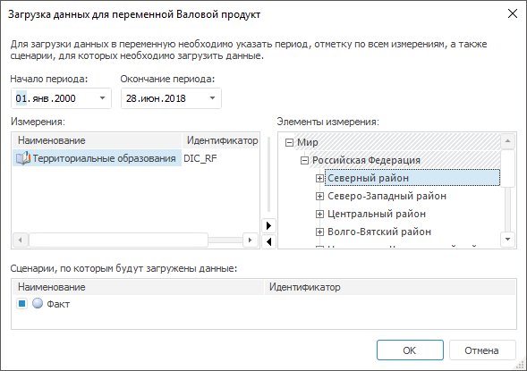

# По формуле

По формуле
-

# По формуле

Способ наполнения «По формуле»
 позволяет получить данные путем вычисления уравнения, созданного на основе
 исходных переменных. В уравнении можно использовать любые арифметические
 операции, круглые скобки, допускается использование статистических, математических
 и пользовательских функций/методов.

Если у наполняемой переменной в [структуре](UiModelling_Work_object_Value_2.htm)
 присутствуют дополнительные измерения, то ниже раскрывающегося списка
 «Динамика» отображаются поля в
 количестве, соответствующем количеству дополнительных измерений. Также
 добавляется флажок «Использовать одну
 спецификацию», при установке которого для всех элементов измерения
 будут использоваться одни исходные переменные и одно уравнение для расчетов.
 По умолчанию флажок снят, и для каждого элемента измерения можно
 задать различные исходные переменные и уравнения для расчета.

Исходные переменные. Список
 переменных контейнера моделирования, на основе которых строится уравнение.
 Переменные не используются в формуле в явном виде. Каждой переменной в
 соответствие ставится элемент с идентификатором вида Xn,
 где n - номер по порядку.

[Для добавления
 переменной](javascript:TextPopup(this))

	Нажмите кнопку «Добавить»
	 и выберите необходимую переменную контейнера моделирования, либо перетащите
	 необходимую переменную в список. Если добавляемая переменная содержит
	 измерения, отсутствующие у редактируемой переменной, то будет отображен
	 диалог «[Изменение
	 размерности](../UiModelling_ChangeDimension.htm)».

[Для фиксации
 переменной](javascript:TextPopup(this))

	Нажмите кнопку «Фиксировать».
	 Если переменная содержит дополнительные измерения, то будет отображено
	 окно «[Изменение
	 размерности](../UiModelling_ChangeDimension.htm)», если дополнительные измерения отсутствуют - окно
	 «Редактирование лага», в котором
	 укажите значение временного лага.

[Для удаления
 переменной](javascript:TextPopup(this))

	Выберите переменную и нажмите кнопку «Удалить».

[Для использования
 переменной в уравнении](javascript:TextPopup(this))

		- выделите переменную и нажмите кнопку «Вставить
		 в уравнение»;

		- выполните команду «Вставить
		 в уравнение» в контекстном меню переменной;

		- перетащите переменную из списка «Переменные»;

		- введите идентификатор элемента, соответствующего переменной,
		 с клавиатуры.

После создания уравнения для выполнения загрузки нажмите кнопку «Загрузить данные».
 Если в уравнении содержатся ошибки (недопустимые знаки операций, указан
 несуществующий элемент и т.д.), то будет отображено соответствующее сообщение,
 содержащее номер позиции с ошибкой. После закрытия сообщения курсор будет
 перемещен в указанную позицию уравнения.

Если уравнение составлено верно, то на экране появится окно:

В данном окне укажите период, отметку по всем имеющимся измерениям и
 общие сценарии переменных, которые входят в уравнение.

См. также:

[Способ наполнения данными](UiModelling_Work_object_Value_4.htm)

		Справочная
		 система на версию 10.9
		 от 18/08/2025,
		 © ООО «ФОРСАЙТ»,
