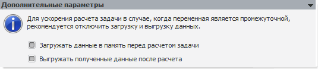

# Дополнительные параметры (переменная)

Дополнительные параметры (переменная)
-

# Дополнительные параметры

На панели задаются дополнительные параметры загрузки и выгрузки данных.

	- Загружать данные в память перед
	 расчетом задачи. Позволяет загружать данные переменной в память
	 перед началом расчета задачи;

	- Выгружать полученные данные
	 после расчета. Если флажок установлен, то после окончания расчёта,
	 полученные данные будут выгружены в переменную.

Если переменная является промежуточной, рекомендуется снимать данные
 флажки для ускорения расчета задачи. По умолчанию флажки установлены.

См. также:

[Объект «Переменная»](uimodelling_work_object_value.htm)

		Справочная
		 система на версию 10.9
		 от 18/08/2025,
		 © ООО «ФОРСАЙТ»,
