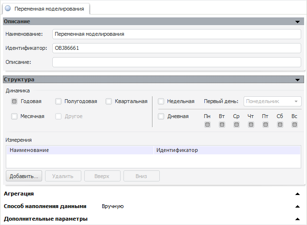

# Переменная моделирования (настольное приложение)

Переменная моделирования (настольное приложение)
-

# Переменная моделирования

Переменные служат для получения исходных данных и выгрузки результатов
 выполнения расчёта. Для анализа данных, содержащихся в переменных, можно
 использовать [описательные
 статистики](../2_3_5_Descriptive_Value/uimodelling_work_object_descriptive.htm).

Переменные моделирования могут являться отдельными объектами репозитория
 или могут быть получены из многомерного источника данных по уникальному
 набору атрибутов.

Переменные моделирования, являющиеся объектами репозитория, предназначены
 для работы в моделировании и прогнозировании в [режиме
 на переменных](../../../1_Modelling/Start_Modelling.htm). Также данные переменные требуются для работы со следующими
 моделями: «[Модель «Межотраслевой баланс»](../2_3_2_Model/interindustry_balance/interindustry_balance.htm)»,
 «[Векторная
 модель коррекции ошибок (ECM)](../2_3_2_Model/error_control/error_control.htm)», «[Модель
 на панельных данных](../2_3_2_Model/PooledModel/UiModelling_PooledModel_Main.htm)», «[Модель Value-At-Risk](../2_3_2_Model/Value-At-Risk/UiModelling_ValueAtRisk_Main.htm)».

Ниже приведено описание работы с переменной, являющейся отдельным объектом
 репозитория.

## Работа с переменной, являющейся объектом репозитория

В общем случае, переменная является многомерным источником данных и
 может содержать несколько измерений, по которым могут производиться расчеты.
 По умолчанию все переменные состоят из календарного и сценарного измерений.
 Эти измерения являются обязательными.

Календарное измерение описывает
 календарную динамику переменной.

Сценарное измерение позволяет
 осуществлять расчёты по разным сценариям развития. Это необходимо, когда
 нужно смоделировать ситуацию «что будет, если …». По умолчанию в сценарном
 измерении существует только один элемент - «Факт»,
 хранящий фактические данные.

Для создания переменной:

	- нажмите кнопку 
	 на панели «[Объекты контейнера](../../2_2_Window_container/uimodelling_window_object.htm)»
	 контейнера;

	- выполните команду «Объект >
	 Создать > Переменная» в главном меню;

	- выполните команду «Создать
	 > Переменная» в контекстном меню панели «[Объекты контейнера](../../2_2_Window_container/uimodelling_window_object.htm)».

В рабочей области будут открыты панели для настройки параметров переменной:

Для работы с переменной предназначены следующие панели:

	- [Описание](uimodelling_work_object_value_1.htm);

	- [Структура](UiModelling_Work_object_Value_2.htm);

	- [Агрегация](UiModelling_Work_object_Value_3.htm);

	- [Способ наполнения
	 данными](UiModelling_Work_object_Value_4.htm);

	- [Дополнительные
	 параметры](UiModelling_Work_object_Value_5.htm).

Для просмотра данных, содержащихся в переменной:

	- нажмите кнопку «Просмотреть
	 данные».

	- выполните команду «Просмотреть
	 данные» в контекстном меню переменной.

Будет открыто представление переменной в виде экспресс-отчета, содержащего
 данные переменной по различным сценариям. В нём также доступно [ручное
 редактирование](uimodelling_work_object_value_4_3.htm) данных переменной с последующим сохранением данных
 и представления.

Для удаления сохраненного представления переменной выполните команду
 «Удалить сохраненное представление»
 в контекстном меню переменной на панели «[Объекты
 контейнера](../../2_2_Window_container/uimodelling_window_object.htm)». Представление будет удалено, данные переменной
 удалены не будут.

См. также:

[Объект «Модель»](../2_3_2_Model/UiModelling_Model.htm)
 | [Объект
 «Метамодель»](../2_3_3_MetaModel/uimodelling_metamodel.htm) |
 [Объект
 «Задача»](../2_3_4_Problem/uimodelling_problem.htm)

		Справочная
		 система на версию 10.9
		 от 18/08/2025,
		 © ООО «ФОРСАЙТ»,
