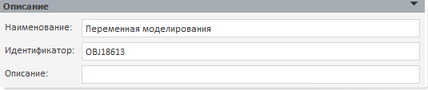

# Описание (переменная, метамодель)

Описание (переменная, метамодель)
-

# Описание

Панель «Описание» содержит поля:

	- Наименование. Строка
	 символов, несущая смысловую нагрузку (функциональность объекта или
	 его содержание);

	- Идентификатор. Последовательность
	 букв латинского алфавита, цифр и знака `_`, представляющих собой уникальный
	 идентификатор объекта. Идентификатор должен начинаться с буквы;

	- Описание. Строка, содержащая
	 любой комментарий к объекту.

Пример панели «Описание»:

См. также:

[Объект «Переменная»](uimodelling_work_object_value.htm)
 | [Объект «Метамодель»](../2_3_3_MetaModel/uimodelling_metamodel.htm)

		Справочная
		 система на версию 10.9
		 от 18/08/2025,
		 © ООО «ФОРСАЙТ»,
