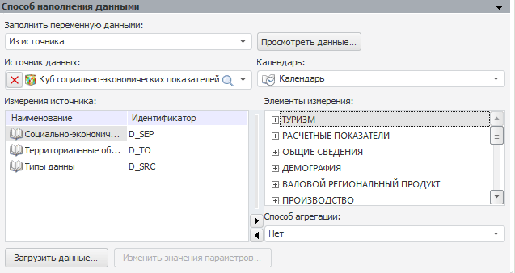
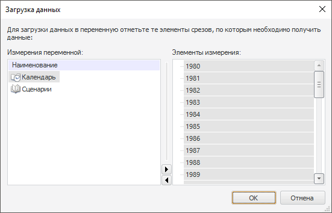

# Из источника

Из источника
-

# Из источника

На панели настраиваются параметры загрузки данных в переменную из указанного
 источника в текущем репозитории. Источниками данных могут выступать: все
 виды кубов и базы данных временных рядов.

На данной панели определите следующие параметры:

	- Источник данных. Укажите
	 объект текущего репозитория, который будет источником данных.

Если источником данных выбран параметрический
 куб, то будет открыт диалог «[Установка значений параметров](uinav.chm::/02_Navigator/General_Principles_of_Work.htm#open_param_object)»,
 в котором определите значения параметров куба. Также данный диалог можно
 вызвать, нажав кнопку «Изменить значения
 параметров»;

	- Календарь. Укажите календарный
	 справочник объекта-источника. В соответствии с данным справочником
	 будет происходить загрузка данных;

	- Измерения источника.
	 Список содержит все измерения источника, отсутствующие у переменной.
	 Для выполнения загрузки данных в переменную, необходимо чтобы размерности
	 переменной и источника совпадали, поэтому зафиксируйте измерения источника,
	 отсутствующие у переменной. Для каждого измерения определите элементы,
	 данные по которым будут загружаться в переменную. Для этого выберите
	 измерение, а затем в списке «Элементы
	 измерения» отметьте необходимые элементы;

	- Способ агрегации. Укажите
	 метод агрегации, применяемый для выделенных элементов измерения. Данные
	 методы совпадают с методами на панели «[Агрегация](UiModelling_Work_object_Value_3.htm)».

После определения всех параметров загрузки нажмите кнопку «Загрузить
 данные», будет отображено окно:

В данном окне укажите элементы измерений, по которым необходимо получить
 данные.

См. также:

[Способ наполнения данными](UiModelling_Work_object_Value_4.htm)

		Справочная
		 система на версию 10.9
		 от 18/08/2025,
		 © ООО «ФОРСАЙТ»,
