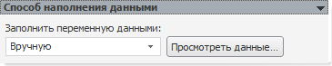

# Вручную

Вручную
-

# Вручную

Наполнение переменной данными выполняется в представлении переменной,
 открытом в инструменте «Аналитические
 запросы (OLAP)». Представление отображается в виде экспресс-отчёта,
 который не является отдельным объектом репозитория, а всегда «прикреплён»
 к переменной. Для открытия представления нажмите кнопку «Просмотреть
 данные»:

Примечание.
 Если представление открыто командой «Просмотреть
 данные» в контекстном меню переменной, то для редактирования данных
 нажмите кнопку «Редактировать данные»
 на вкладке «Главная» ленты инструментов
 экспресс-отчета.

Данные представления отображаются в таблице и на диаграмме, расположенной
 ниже. По умолчанию в таблице включена [фильтрация
 пустых значений](UiAnalyticalArea.chm::/Working_with_table_data/Filtering.htm).
 Для отключения фильтрации перейдите на вкладку «Главная»
 на ленте инструментов и переведите кнопку «Фильтр»
 в ненажатое состояние.

Для ввода данных переменной можно использовать таблицу или вводить данные
 с помощью [редактирования
 данных на диаграмме](UiDiagrams.chm::/Edit_DataSeries.htm).

После завершения ввода, необходимо [сохранить
 данные](UiAnalyticalArea.chm::/Working_with_table_data/Edit_and_save_data.htm), выполнив команду «Сохранить»
 в главном меню экспресс-отчета или нажать кнопку «Сохранить
 изменения» на вкладке «Данные»
 на ленте инструментов. Для сохранения представления в качестве отдельного
 объекта репозитория выполните команду «[Сохранить
 как](UiExpress.chm::/Express/UiExpress_Express_Save.htm)»
 в главном меню экспресс-отчета.

См. также:

[Способ наполнения данными](UiModelling_Work_object_Value_4.htm)
 | [Аналитические
 запросы](UiExpress.chm::/purpose/UiExpress_Purpose.htm)

		Справочная
		 система на версию 10.9
		 от 18/08/2025,
		 © ООО «ФОРСАЙТ»,
