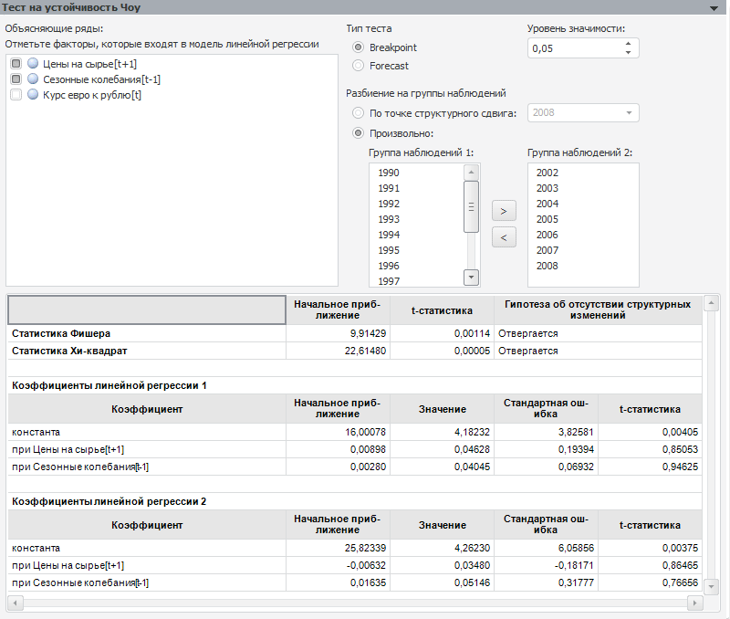

# Тест на устойчивость Чоу

Тест на устойчивость Чоу
-

# Тест на устойчивость Чоу

Применяется для проверки регрессионной однородности двух выборок данных.

Параметры теста:

	- Объясняющие ряды. Факторы,
	 которые воздействуют на поведение объясняемой переменной. По умолчанию
	 в списке содержатся все факторы тестируемой модели линейной регрессии.
	 Флажок фактора - признак его участия в тесте. Для исключения фактора
	 из теста снимите флажок. Число объясняющих рядов должно быть не менее
	 одного.

	- Тип теста. Установите
	 переключатель в зависимости от соотношения количества элементов в
	 группах:

	-

		- Breakpoint. Количество
		 элементов в обеих группах примерно одинаковое;

		- Forecast. Количество
		 элементов в одной из групп существенно превосходит количество
		 элементов в другой.

	- Уровень значимости.
	 Значение уровня значимости, при котором гипотеза будет отвергнута.

	- Разбиение на группы наблюдений.
	 Распределите по группам тестируемые наблюдения (наблюдения определяют
	 период идентификации). Созданные группы и будут проверяться на однородность.
	 Установка переключателя определяет способ разбиения на группы:

	-

		- По точке структурного сдвига.
		 Группы формируются по точке структурного сдвига. В раскрывающемся
		 списке укажите последнее наблюдение, которое будет входить в первую
		 группу;

		- Произвольно. Для
		 формирования групп используются кнопки 
		 и .

Результаты выводятся ниже в виде таблицы, содержащей:

	- [статистику
	 Фишера](Lib.chm::/05_Statistics/UiModelling_Fisher.htm);

	- [статистику
	 Хи-квадрат](Lib.chm::/05_Statistics/UiModelling_ChiTest.htm). Не рассчитывается для данного теста;

Для каждой статистики приводится начальное
 приближение, значение t-статистики и результат теста: принимается или
 отвергается гипотеза об отсутствии структурных изменений;

	- коэффициенты линейной регрессии.
	 Коэффициенты регрессии для каждой группы, рассчитанные при отмеченных
	 факторах. Если в модели используется авторегрессия и скользящее
	 среднее, то коэффициенты модели будут содержать коэффициенты авторегрессии
	 и скользящего среднего.

Примечание.
 Если параметры теста заданы неверно, то таблица результатов отображена
 не будет. На её месте будет выведено сообщение об ошибке.

См. также:

[Диагностические тесты](UiModelling_DiagnosticTest.htm)

		Справочная
		 система на версию 10.9
		 от 18/08/2025,
		 © ООО «ФОРСАЙТ»,
