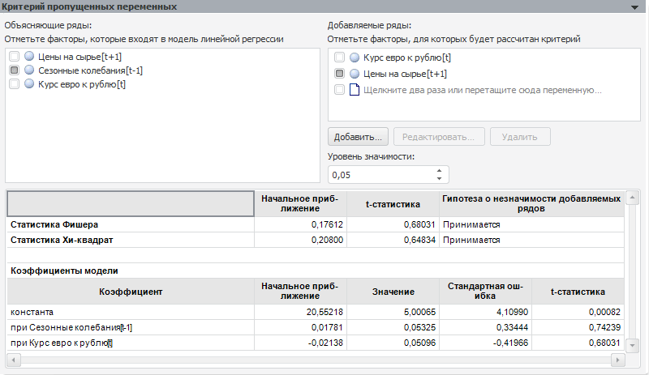

# Критерий пропущенных переменных

Критерий пропущенных переменных
-

# Критерий пропущенных переменных

Позволяет добавить в существующую регрессию ряд новых факторов и проверить,
 вносят ли они существенный вклад в вариацию зависимой переменной.

Параметры теста:

	- Объясняющие ряды. Факторы,
	 которые воздействуют на поведение объясняемой переменной. По умолчанию
	 в списке содержатся все факторы тестируемой модели линейной регрессии.
	 Флажок фактора - признак его участия в тесте. Для исключения фактора
	 из теста снимите флажок. Число объясняющих рядов должно быть не менее
	 одного;

	- Добавляемые ряды. Факторы,
	 для которых проверяется гипотеза о значимости для регрессионной модели.
	 Добавляемым рядом может быть ряд, отсутствующий в модели, либо фактор
	 модели, если он не отмечен флажком в списке объясняющих рядов.

Кнопки «Добавить»,
 «Редактировать», «Удалить»
 работают аналогично кнопкам на панели «Спецификация»
 в модели [линейной
 регрессии](../Specification/8_Linear_regression/uimodelling_model_specification_linaer_reg.htm) и позволяют управлять набором тестируемых рядов. Кнопки
 «Редактировать» и «Удалить»
 доступны, если выделен ряд данных;

	- Уровень значимости.
	 Значение уровня значимости, при котором гипотеза будет отвергнута.

Результаты выводятся ниже в виде таблицы, содержащей:

	- [статистику
	 Фишера](Lib.chm::/05_Statistics/UiModelling_Fisher.htm);

	- [статистику
	 Хи-квадрат](Lib.chm::/05_Statistics/UiModelling_ChiTest.htm).

Для каждой статистики приводится начальное
 приближение, значение t-статистики и результат теста: принимается или
 отвергается гипотеза о незначимости добавляемых рядов;

	- коэффициенты модели.
	 Коэффициенты регрессии, рассчитанные при факторах, отмеченных в списках
	 объясняющих и добавляемых рядов. Если в модели используется авторегрессия
	 и скользящее среднее, то коэффициенты модели будут содержать коэффициенты
	 авторегрессии и скользящего среднего.

Примечание.
 Если параметры теста заданы неверно, то таблица результатов отображена
 не будет. На её месте будет выведено сообщение об ошибке.

См. также:

[Диагностические тесты](UiModelling_DiagnosticTest.htm)

		Справочная
		 система на версию 10.9
		 от 18/08/2025,
		 © ООО «ФОРСАЙТ»,
