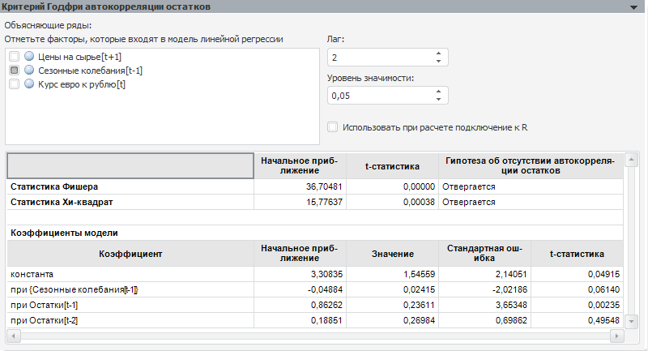

# Критерий Годфри автокорреляции остатков

Критерий Годфри автокорреляции остатков
-

# Критерий Годфри автокорреляции остатков

Позволяет выполнить тест на автокорреляцию остатков модели линейной
 регрессии.

Параметры теста:

	- Объясняющие ряды. Факторы,
	 которые воздействуют на поведение объясняемой переменной. По умолчанию
	 в списке содержатся все факторы тестируемой модели линейной регрессии.
	 Флажок фактора - признак его участия в тесте. Для исключения фактора
	 из теста снимите флажок. Число объясняющих рядов должно быть не менее
	 одного;

	- Лаг. Значение лага для
	 тестируемых факторов модели линейной регрессии;

	- Уровень значимости.
	 Значение уровня значимости, при котором гипотеза будет отвергнута;

	- Использовать при расчете подключение
	 к R. Установите флажок, если для расчета теста требуется использовать
	 R. По умолчанию флажок снят и расчет выполняется с помощью методов
	 продукта «Форсайт. Аналитическая платформа».

Результаты выводятся ниже в виде таблицы, содержащей:

	- [статистику
	 Фишера](Lib.chm::/05_Statistics/UiModelling_Fisher.htm);

	- [статистику
	 Хи-квадрат](Lib.chm::/05_Statistics/UiModelling_ChiTest.htm).

Для каждой статистики приводится начальное
 приближение, значение t-статистики и результат теста: принимается или
 отвергается гипотеза об отсутствии автокорреляции остатков;

	- коэффициенты модели.
	 Коэффициенты регрессии, рассчитанные при отмеченных факторах (включая
	 члены авторегрессии). Если в модели используется авторегрессия
	 и скользящее среднее, то коэффициенты модели будут содержать коэффициенты
	 авторегрессии и скользящего среднего.

Примечание.
 Если параметры теста заданы неверно, то таблица результатов отображена
 не будет. На её месте будет выведено сообщение об ошибке.

См. также:

[Диагностические тесты](UiModelling_DiagnosticTest.htm)

		Справочная
		 система на версию 10.9
		 от 18/08/2025,
		 © ООО «ФОРСАЙТ»,
