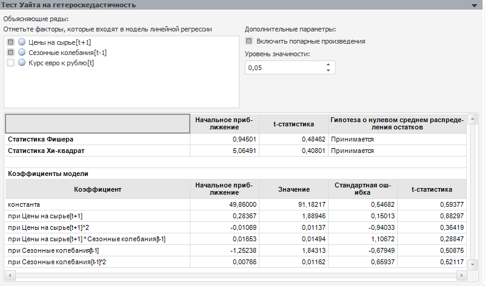

# Тест Уайта на гетероскедастичность

Тест Уайта на гетероскедастичность
-

# Тест Уайта на гетероскедастичность

Позволяет проверить гетероскедастичность остатков модели линейной регрессии.

Параметры теста:

	- Объясняющие ряды. Факторы,
	 которые воздействуют на поведение объясняемой переменной. По умолчанию
	 в списке содержатся все факторы тестируемой модели линейной регрессии.
	 Флажок фактора - признак его участия в тесте. Для исключения фактора
	 из теста снимите флажок. Число объясняющих рядов должно быть не менее
	 одного.

	- Включить попарные произведения.
	 Установка флажка позволяет использовать не только имеющиеся объясняющие
	 ряды, но и их попарные произведения. Если рассматривается два ряда
	 S1 и S2,
	 то при использовании попарных произведений будут дополнительно рассмотрены
	 регрессоры: S1*S1, S1*S2, S2*S2.
	 Не рекомендуется включать попарные произведения, если количество объясняющих
	 рядов (регрессоров) велико.

	- Уровень значимости.
	 Значение уровня значимости, при котором гипотеза будет отвергнута.

Результаты выводятся ниже в виде таблицы, содержащей:

	- [статистику
	 Фишера](Lib.chm::/05_Statistics/UiModelling_Fisher.htm). Не рассчитывается для данного теста;

	- [статистику
	 Хи-квадрат](Lib.chm::/05_Statistics/UiModelling_ChiTest.htm);

Для каждой статистики приводится начальное
 приближение, значение t-статистики и результат теста: принимается или
 отвергается гипотеза о нулевом среднем распределения остатков;

	- коэффициенты модели.
	 Коэффициенты регрессии, рассчитанные при отмеченных факторах (включая
	 попарные произведения, если они используются). Если в модели
	 используется авторегрессия и скользящее среднее, то коэффициенты модели
	 будут содержать коэффициенты авторегрессии и скользящего среднего.

Примечание.
 Если параметры теста заданы неверно, то таблица результатов отображена
 не будет. На её месте будет выведено сообщение об ошибке.

См. также:

[Диагностические тесты](UiModelling_DiagnosticTest.htm)

		Справочная
		 система на версию 10.9
		 от 18/08/2025,
		 © ООО «ФОРСАЙТ»,
