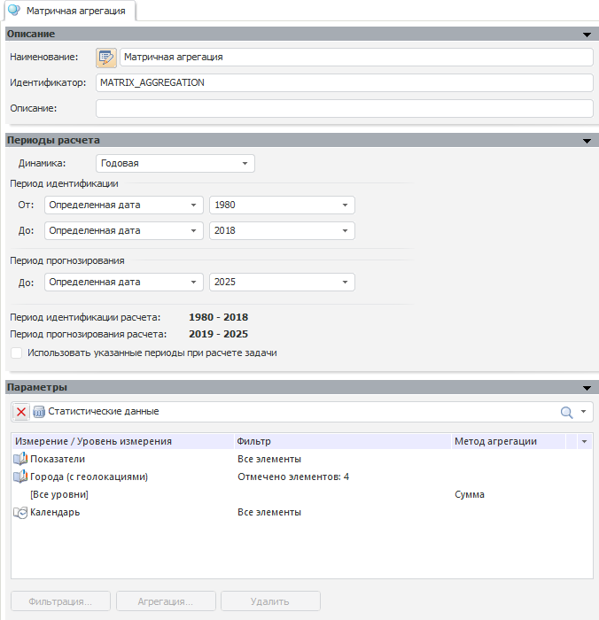

# Модель матричной агрегации

Модель матричной агрегации
-

# Модель матричной агрегации

Модель матричной агрегации предназначена для агрегации по нескольким
 измерениям источника данных:

Изначально отображаются панели:

	- [Описание](../Standart_Model/UiModelling_Model_1.htm).
	 Предназначена для задания наименования и идентификатора модели. Аналогична
	 стандартной панели;

	- [Периоды
	 расчета](../Standart_Model/UiModelling_Model_2.htm). Предназначена для настройки периода расчета модели.
	 Аналогична стандартной панели;

	- [Параметры](MatrixAggregationParams.htm).
	 Предназначена для настройки параметров модели.

См. также:

[Работа
 в настольном приложении](../../../Modelling_process.htm) | [Модель](../UiModelling_Model.htm)

		Справочная
		 система на версию 10.9
		 от 18/08/2025,
		 © ООО «ФОРСАЙТ»,
