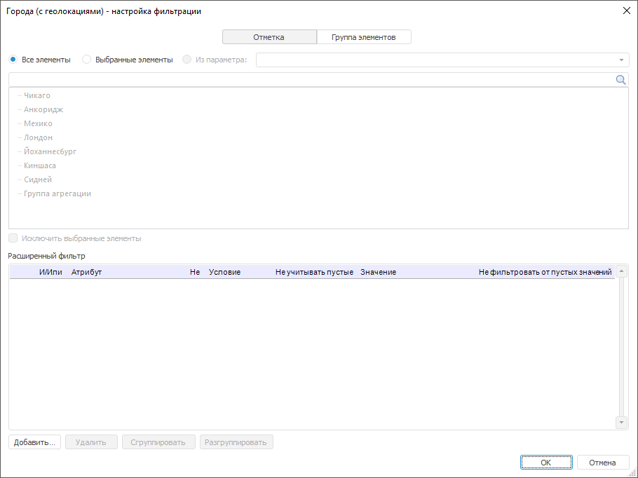
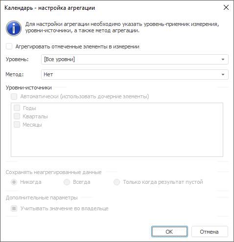

# Параметры: модель матричной агрегации

Параметры: модель матричной агрегации
-

# Параметры

	Панель предназначена для настройки параметров расчёта матричной
	 агрегации:

	

	Порядок настройки:

		- Выберите источник данных.
		 В качестве источника данных можно использовать все виды [кубов](UiNavObj.chm::/Cube/UiMd_Cube_Type.htm),
		 кроме вычисляемых, и базы данных временных рядов. После выбора
		 источника данных будут отображены его измерения.

		- [Настройте
		 фильтрацию измерений](MatrixAggregationParams.htm#filtersetup). Фильтрация требуется, если агрегацию
		 необходимо рассчитать по определённым элементам измерений.

		- [Настройте
		 агрегацию измерений](MatrixAggregationParams.htm#aggrmethod).

	В результате модель будет рассчитывать матричную агрегацию.

## Настройка фильтрации измерений

	Для выбора элементов измерения, по которым будет рассчитываться
	 матричная агрегация, используйте диалог «Настройка
	 фильтрации».

	Для отображения диалога выберите измерение и нажмите кнопку «Фильтрация»:

	

	Порядок настройки:

		- Выберите по каким сущностям будет настроен фильтр:

			- по заданной отметке
			 элементов. Установите переключатель «Отметка».
			 На вкладке будет отображён список всех элементов измерения;

			- по выбранной группе
			 элементов. Установите переключатель «Группа
			 элементов». На вкладке будет отображён список всех
			 групп элементов измерения.

		- Выберите элементы, по которым будет рассчитываться многомерная
		 агрегация. Установите один из переключателей:

			- Все элементы.
			 Расчёт матричной агрегации будет идти по всем элементам измерения.
			 Способ доступен, если фильтр настроен по отметке элементов;

			- Выбранные элементы.
			 Расчёт матричной агрегации будет идти по элементам измерения,
			 выбранным на данной вкладке. Способ доступен, если фильтр
			 настроен по отметке элементов;

			- Выбрать группу.
			 Расчёт матричной агрегации будет идти по группе элементов,
			 выбранной на данной вкладке. Способ доступен, если фильтр
			 настроен по группе элементов;

			- Из параметра.
			 Расчёт матричной агрегации будет идти по элементам, заданным
			 [параметром](../../2_3_3_MetaModel/Metamodel_params.htm).
			 Способ доступен и для отметки, и для группы элементов, если
			 метамодель, рассчитывающая модель матричной агрегации, содержит
			 параметры.

	Если требуется, чтобы матричной агрегация
	 рассчитывалась по всем элементам, кроме отмеченных, то установите
	 флажок «Исключить выбранные элементы».

		- Для задания условий, которым должны соответствовать атрибуты
		 элементов, при выполнении расчёта матричной агрегации, используйте
		 группу параметров «Расширенный
		 фильтр». Работа с данной группой параметров аналогична
		 работе с диалогом «[Расширенный
		 фильтр](uinav.chm::/GUI/UFE/AttributeFiltering.htm)».

	В результате матричная агрегации будет рассчитываться только по
	 элементам, соответствующих фильтру.

## Настройка агрегации измерений

	Для настройки параметров агрегации измерения используйте диалог
	 «Настройка агрегации».

	Для отображения диалога выберите измерение и нажмите кнопку «Агрегация»:

	

	Порядок настройки:

		- Определите элементы измерения, участвующие в агрегации.
		 Если требуется, чтобы в агрегации участвовали только отмеченные
		 элементы измерения, то установите флажок «Агрегировать
		 отмеченные элементы в измерении». По умолчанию флажок снят
		 и агрегация рассчитывается по всем элементам измерения.

		- Выберите уровень-приёмник в измерении, для которого настраивается
		 агрегация. Используйте раскрывающийся список «Уровень».
		 Если в качестве уровня выбран элемент «[Все
		 уровни]», то агрегация будет настроена для всех уровней,
		 в том числе и для тех, которые могут появиться позже.

		- Задайте метод агрегации в раскрывающемся списке «Метод».
		 Для подробного описания доступных методов агрегации обратитесь
		 к разделу «[Методы агрегации](#methods)».

		- Задайте уровни-источники для агрегации.

	Для автоматического определения уровней-источников
	 установите флажок «Автоматически
	 (использовать дочерние элементы)».

	Для определения уровней-источников вручную
	 убедитесь, что флажок «Автоматически
	 (использовать дочерние элементы)» снят и отметьте флажками
	 все необходимые уровни.

	Если настройка агрегации выполняется
	 для всех уровней, то уровни-источники всегда определяются автоматически.

		- Определите метод сохранения неагрегированных данных на уровне-приёмнике.
		 Используйте группу переключателей «Сохранять
		 неагрегированные данные»:

			- Никогда. Агрегированные
			 данные всегда будут записываться на уровень-приёмник;

			- Всегда. Агрегированные
			 данные не будут записаны на уровень-приёмник, если на уровне-приёмнике
			 есть данные;

			- Только когда результат
			 пустой. Агрегированные данные будут записаны на уровень-приёмник,
			 только если результат агрегации пустой.

		- Определите, учитывать ли при расчёте агрегации значение
		 уровня-приёмника. По умолчанию агрегация рассчитывается с учётом
		 значения уровня приёмника. Если данное значение необходимо исключить
		 из агрегации, то снимите флажок «Учитывать
		 значение во владельце».

	В результате будет настроена агрегация для выбранного измерения.

### Особенности расчёта агрегации

	Если в отметке присутствуют разрывы, то агрегация рассчитывается
	 с прыжком на уровень. Разрыв в отметке - это когда отмечены дочерние
	 элементы, но не отмечен их родительский элемент В таком случае данные
	 дочерних элементов неотмеченного родительского элемента используются
	 для расчета следующего родительского элемента.

	Например, есть иерархия, в которой с разрывом отмечены элементы:

	

	Агрегация с прыжком на уровень будет рассчитываться
	 следующим образом:

			 Шаг
			 Установлен флажок «Учитывать
			 значение во владельце»
			 Снят флажок «Учитывать
			 значение во владельце»

			 Выполняется расчёт на нижем уровне

			 Item 1.1 = Item 1.1 + item 1.1.1 + item 1.1.2
			 Item 1.1 = item 1.1.1 + item 1.1.2

			 Вычисляется значение верхнего
			 уровня

			 Item 2 = Item 2+ item 2.1.1 + 2.1.2
			 Item 2 = item 2.1.1 + 2.1.2

			 Item 3 = Item 3 + item 3.1.1
			 Item 3 = item 3.1.1

			 Вычисляется значение для корневого
			 элемента

			 Root = Root + item 1.1 + item 1.3 + item 2 + item 3
			 Root = item 1.1 + item 1.3 + item 2 + item 3

### Методы агрегации

	Для агрегации измерения в модели матричной агрегации доступны следующие
	 методы:

		- Нет. Агрегация не
		 производится;

		- Сумма. Суммируются
		 элементы уровня-источника;

		- Минимум. На уровне-источнике
		 выбирается минимальное значение;

		- Максимум. На уровне-источнике
		 выбирается максимальное значение;

		- Количество непустых.
		 Определяется количество непустых значений на уровне-источнике;

		- Количество пустых.
		 Определяется количество пустых значений на уровне-источнике;

		- Количество всех дочерних.
		 Определяется количество дочерних элементов на уровне-источнике;

		- Арифметическое среднее.
		 Определяется среднее значение элементов уровня с учетом пустых
		 значений;

		- Фактическое среднее.
		 Определяется среднее значение элементов уровня без учета пустых
		 значений;

		- Первое фактическое.
		 На уровне-источнике берется первое имеющееся (фактическое) значение;

		- Последнее фактическое.
		 На уровне-источнике берется последнее имеющееся (фактическое)
		 значение;

		- Среднеквадратическое отклонение
		 на выборке. Определяется среднеквадратическое отклонение
		 ряда по выборке;

		- Медиана. Определяется
		 медиана для значений на уровне-источнике;

		- Среднеквадратическое отклонение.
		 Определяется среднеквадратическое отклонение ряда по генеральной
		 совокупности;

		- Количество различных значений.
		 Определяется количество уникальных значений на уровне-источнике.

См. также:

[Модель матричной агрегации](MatrixAggregation.htm)

		Справочная
		 система на версию 10.9
		 от 18/08/2025,
		 © ООО «ФОРСАЙТ»,
