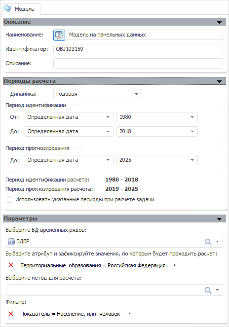

# Модель на панельных данных

Модель на панельных данных
-

# Модель на панельных данных

Панельные данные представляют собой прослеженные во времени пространственные
 микроэкономические выборки, т.е. они состоят из наблюдений одних и тех
 же экономических единиц, которые осуществляются в последовательные периоды
 времени. Панельные данные насчитывают три измерения: признаки - объекты
 - время. Их использование дает ряд существенных преимуществ при оценке
 параметров регрессионных зависимостей, так как они позволяют проводить
 как анализ временных рядов, так и анализ пространственных выборок. С помощью
 подобных данных изучают бедность, безработицу, преступность, а также оценивают
 результативность государственных программ в области социальной политики.

Окно модели:

Изначально отображаются панели:

	- [Описание](../Standart_Model/UiModelling_Model_1.htm).
	 Предназначена для задания наименования и идентификатора модели. Аналогична
	 стандартной панели;

	- [Периоды
	 расчета](../Standart_Model/UiModelling_Model_2.htm). Предназначена для настройки периода расчета модели.
	 Аналогична стандартной панели;

	- [Параметры](UiModelling_Pooled_Param.htm). Предназначена
	 для настройки основных параметров модели.

См. также:

[Объект «Модель»](../UiModelling_Model.htm)
 | [Регрессия
 на панельных данных](Lib.chm::/01_Regression_models/UiModelling_PooledModel.htm)

		Справочная
		 система на версию 10.9
		 от 18/08/2025,
		 © ООО «ФОРСАЙТ»,
