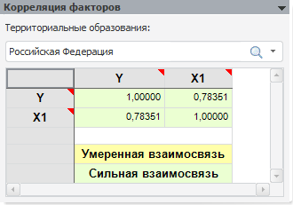

# Корреляция факторов (регрессия на панельных данных)

Корреляция факторов (регрессия на панельных данных)
-

# Корреляция факторов

Панель «Корреляция факторов»
 отображает [корреляцию](Lib.chm::/05_Statistics/UiModelling_CoeffCorr.htm)
 объясняющих переменных для выбранного значения атрибута/ элемента измерения,
 по которому был произведен расчет:

Ячейки закрашены соответствующими цветами:

	- Желтый. Умеренная взаимосвязь.
	 Значение коэффициента корреляции находится в диапазоне по абсолютному
	 значению от 0,5 до 0,75;

	- Зеленый. Сильная взаимосвязь.
	 Значение коэффициента корреляции находится в диапазоне по абсолютному
	 значению от 0,75 и выше.

См. также:

[Модель
 на панельных данных](UiModelling_PooledModel_Main.htm) | [Объект
 «Модель»](../UiModelling_Model.htm)

		Справочная
		 система на версию 10.9
		 от 18/08/2025,
		 © ООО «ФОРСАЙТ»,
