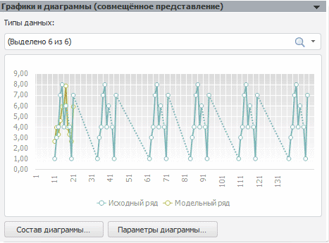
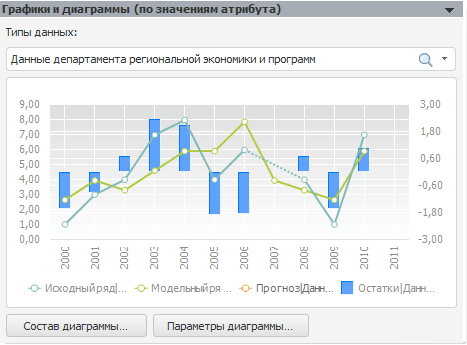

# Графики и диаграммы

Графики и диаграммы
-

# Графики и диаграммы

Основные принципы работы с панелями «Графики
 и диаграммы (совмещённое представление)» и «Графики
 и диаграммы (по значениям атрибута)» аналогичны принципам работы
 со стандартной панелью «[Графики
 и диаграммы](../Standart_Model/UiModelling_Model_Fact.htm)».

## Графики и диаграммы (совмещённое
 представление)

Особенность диаграммы в том, что данные отображаются для каждого наблюдения.
 По оси Х отображается номер наблюдения.

Из раскрывающегося списка выбираются значения атрибута/элементы измерения,
 по которому был произведен расчет. Атрибут/измерение выбран на панели
 «[Параметры](UiModelling_Pooled_Param.htm)».

По умолчанию, на диаграмме отображаются исходный ряд (объясняемый ряд)
 и модельный ряд (результаты расчета модели). Остальные ряды отображаются
 опционально.

Диаграмма масштабируется по осям X
 и Y. Для настройки параметров
 масштабирования используйте команду «Масштабирование»
 в контекстном меню.

## Графики и диаграммы (по значениям
 атрибута)

Особенность диаграммы в том, что для каждого отмеченного значения атрибута/элемента
 измерения выводится набор рядов, выбранных для отображения в составе диаграммы.

Из раскрывающегося списка выбираются значения атрибута/элементы измерения,
 по которому был произведен расчет. Атрибут/измерение выбран на панели
 «[Параметры](UiModelling_Pooled_Param.htm)».

По умолчанию, на диаграмме отображаются исходный ряд, модельный ряд,
 ряд остатков и прогнозный ряд. Остальные ряды отображаются опционально.

См. также:

[Объект
 «Модель»](../UiModelling_Model.htm) | [Масштабирование
 диаграммы](UiReport.chm::/desktop/Diagrams/UiDiagrams_Report_scaling.htm)

		Справочная
		 система на версию 10.9
		 от 18/08/2025,
		 © ООО «ФОРСАЙТ»,
