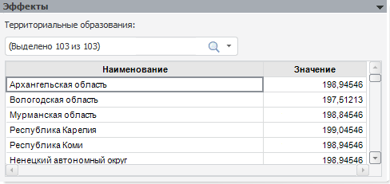

# Эффекты

Эффекты
-

# Эффекты

Панель отображается, если рассчитывается модель с фиксированными эффектами.

Вверху панели выбираются значения атрибута/элементы измерения, по которому
 был произведен расчет. В таблице отображаются значения лишь для выбранных
 эффектов.

См. также:

[Модель
 на панельных данных](UiModelling_PooledModel_Main.htm) | [Объект
 «Модель»](../UiModelling_Model.htm)

		Справочная
		 система на версию 10.9
		 от 18/08/2025,
		 © ООО «ФОРСАЙТ»,
