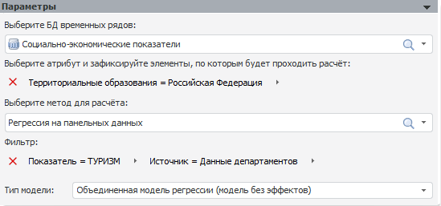
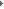
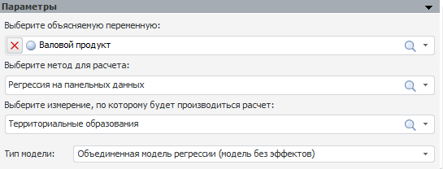

# Параметры модели на панельных данных

Параметры модели на панельных данных
-

# Параметры

Вид панели и работа с ней зависят от того, в каком [режиме](../../../../1_Modelling/Start_Modelling.htm)
 был запущен контейнер моделирования: на атрибутах или на переменных.

## Параметры модели в режиме на атрибутах

Задайте следующие параметры:

[База данных
 временных рядов](javascript:TextPopup(this))

	Для задания базы данных временных рядов, атрибуты и данные которой
	 будут использоваться для расчета модели, используйте раскрывающийся
	 список «Выберите базу данных временных
	 рядов». По умолчанию выбрана база, являющаяся [источником
	 данных](../../../2_1_Create_Cont_Modeling/UiModelling_Create_Container.htm) для текущего контейнера моделирования.

[Атрибут, по
 элементам которого будет проходить расчет](javascript:TextPopup(this))

		- В поле «Выберите атрибут
		 и зафиксируйте элементы, по которым будет происходить расчёт»
		 выберите атрибут базы данных временных рядов, по которому будет
		 производиться расчет. Доступен выбор только одного атрибута.

		- Щёлкните по атрибуту. Будет отображен
		 список со значениями атрибута. Выберите значения, по которым будет
		 производиться расчет.

	В результате модель будет рассчитана только по заданным значениям
	 указанного атрибута.

	Операции с атрибутами:

		- для замены атрибута
		 вызовите контекстное меню атрибута или нажмите кнопку . Будет отображено меню,
		 в котором в группе «Заменить
		 на» выберите требуемый атрибут;

		- для сброса атрибута
		 нажмите кнопку .

[Метод расчета](javascript:TextPopup(this))

	В раскрывающемся списке «Выберите
	 метод для расчета» укажите метод расчёта модели:

		- [регрессия
		 на панельных данных](Lib.chm::/01_Regression_models/UiModelling_PooledModel.htm);

		- [бинарная
		 регрессия на панельных данных](Lib.chm::/01_Regression_models/UiModelling_BinaryModel.htm).

[Фильтр](javascript:TextPopup(this))

	После выбора атрибута, по элементам которого будет происходить расчет,
	 необходимо зафиксировать значения остальных атрибутов базы данных
	 временных рядов. Для этого используйте поле «Фильтр».
	 Набор атрибутов в данном поле формируется автоматически исходя из
	 атрибута, выбранного для проведения расчета.

	Для задания значения атрибута:

		- Щёлкните по атрибуту. Будет отображен
		 список со значениями атрибута.

		- Выберите значение атрибута. Доступна только единичная отметка.

	Для сброса выбранных значений нажмите кнопку .

[Тип рассчитываемой модели](javascript:TextPopup(this))

	Примечание.
	 Параметр доступен, если в качестве метода расчета используется [регрессия
	 на панельных данных](Lib.chm::/01_Regression_models/UiModelling_PooledModel.htm).

	В раскрывающемся списке «Тип модели»
	 укажите требуемую модель регрессии:

		- Объединенная модель регрессии
		 (модель без эффектов). Используется по умолчанию. Не позволяет
		 в должной мере использовать преимущества панельных данных;

		- Модель с фиксированными
		 эффектами. Модель опирается на структуру панельных данных,
		 что позволяет учитывать неизмеримые индивидуальные различия объектов
		 (эффекты).

## Параметры модели в режиме на переменных

Задайте следующие параметры:

[Объясняемая
 переменная](javascript:TextPopup(this))

	В раскрывающемся списке «Выберите
	 объясняемую переменную» укажите переменную, по которой будет
	 производиться расчет модели. Переменная должна содержать несколько
	 [измерений](../../2_3_1_Value/UiModelling_Work_object_Value_2.htm).

[Метод расчета](javascript:TextPopup(this))

	В раскрывающемся списке «Выберите
	 метод для расчета» укажите метод расчёта модели:

		- [регрессия
		 на панельных данных](Lib.chm::/01_Regression_models/UiModelling_PooledModel.htm);

		- [бинарная
		 регрессия на панельных данных](Lib.chm::/01_Regression_models/UiModelling_BinaryModel.htm).

[Измерение, по
 которому будет производиться расчёт](javascript:TextPopup(this))

	После выбора объясняемой переменной укажите измерение данной переменной,
	 по которому будет рассчитана модель. Для этого используйте поле «Выберите измерение, по которому будет производиться
	 расчёт», которое содержит все [измерения](../../2_3_1_Value/UiModelling_Work_object_Value_2.htm)
	 переменной.

	Если у переменной только одно измерение, то оно будет выбрано автоматически.
	 Если у переменной больше одного измерения, то после выбора измерения
	 для расчета необходимо зафиксировать оставшиеся измерения. Для этого
	 нажмите кнопку «Зафиксировать».
	 Будет отображен диалог «[Изменение размерности](../../UiModelling_ChangeDimension.htm)»,
	 в котором зафиксируйте оставшиеся измерения.

[Тип рассчитываемой модели](javascript:TextPopup(this))

	Примечание.
	 Параметр доступен, если в качестве метода расчета используется [регрессия
	 на панельных данных](Lib.chm::/01_Regression_models/UiModelling_PooledModel.htm).

	В раскрывающемся списке «Тип модели»
	 укажите требуемую модель регрессии:

		- Объединенная модель регрессии
		 (модель без эффектов). Используется по умолчанию. Не позволяет
		 в должной мере использовать преимущества панельных данных;

		- Модель с фиксированными
		 эффектами. Модель опирается на структуру панельных данных,
		 что позволяет учитывать неизмеримые индивидуальные различия объектов
		 (эффекты).

## Дальнейшая настройка модели

Если настройки на панели «Параметры»
 заданы верно, то будут отображены дополнительные панели для настройки
 модели:

	- Спецификация. Вид панели
	 отличается в зависимости от метода расчета: [регрессия
	 на панельных данных](UiModelling_Pooled_Specification.htm) или [бинарная
	 регрессия на панельных данных](UiModelling_Pooled_Specification_binary.htm);

	- [Идентифицированное
	 уравнение](../Standart_Model/identified_equation.htm). Аналогична стандартной панели;

	- [Статистические
	 характеристики](../Standart_Model/statistical_features.htm). Аналогична стандартной панели;

	- [Графики
	 и диаграммы (совмещённое представление)](UiModelling_Pooled_Diagr_common.htm#diagr_comm);

	- [Графики
	 и диаграммы (по значениям атрибута)](UiModelling_Pooled_Diagr_common.htm#diagr_elem);

	- [Ряды
	 (числовые значения)](UiModelling_Pooled_Value.htm);

	- [Объясняющие
	 переменные (числовые значения)](UiModelling_Pooled_Value.htm);

	- Панели, предназначенные только для метода «Регрессия
	 на панельных данных»:

	-

		- [Дополнительные параметры](../Standart_Model/UiModelling_Model_Extra.htm).
		 Аналогична стандартной панели;

		- [Просмотр
		 результатов](../Standart_Model/uimodelling_model_view.htm). Аналогична стандартной панели;

		- [Корреляция
		 факторов](UiModelling_Pooled_Correlation.htm);

		- [Эффекты](UiModelling_Pooled_Effects.htm);

	- Панели, предназначенные только для метода «Бинарная
	 регрессия на панельных данных»:

	-

		- [Начальные
		 значения](../Standart_Model/UiModelling_Init_Vals.htm). Аналогична панели для [модели
		 бинарного выбора](../Specification/Binary_regression/UiModelling_Spec_Binary_regression.htm);

		- [Качество модели](../Standart_Model/UiModelling_Model_Quality.htm). Аналогична
		 панели для [модели
		 бинарного выбора](../Specification/Binary_regression/UiModelling_Spec_Binary_regression.htm).

При возникновении ошибок при расчете метода отображается панель «[Ошибки](../Standart_Model/UiModelling_Model_Error.htm)»
 (аналогична стандартной панели).

См. также:

[Модель
 на панельных данных](UiModelling_PooledModel_Main.htm)

		Справочная
		 система на версию 10.9
		 от 18/08/2025,
		 © ООО «ФОРСАЙТ»,
