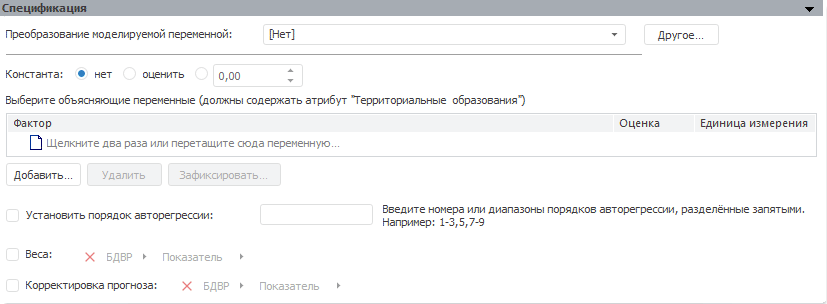

# Спецификация регрессии на панельных данных

Спецификация регрессии на панельных данных
-

# Спецификация

Панель «Спецификация» для метода
 расчёта «Регрессия на панельных данных»:

На панели задаются объясняющие переменные и их параметры:

	- [Преобразование
	 моделируемой переменной](../../UiModelling_work_Changes.htm). Определяется тип преобразования,
	 которое осуществляется над моделируемой переменной перед расчетом
	 модели. Выбранное преобразование применяется для каждого значения
	 атрибута/элемента измерения, по которому ведется расчет;

	- Константа. Переключатели
	 определяют режим задания константы для модели:

	-

		- Нет.
		 Установлено по умолчанию. Константа в модели не используется;

		- Оценить.
		 Значение константы будет оценено автоматически в процессе расчёта
		 модели. Полученное значение будет отображено в поле ввода справа;

		- Указание значения константы.
		 Значение константы задается пользователем в соответствующем поле,
		 которое доступно для ввода после установки данного переключателя;

	- Выберите объясняющие переменные.
	 Задаются объясняющие переменные (факторы), влияющие на объясняемую
	 переменную. Все факторы должны содержать атрибут/измерение, по которому
	 осуществляется расчёт модели. Для добавленных факторов в соответствующем
	 столбце отображается оцененное значение коэффициента. Данные значения
	 для факторов также отображаются на панели «[Идентифицированное
	 уравнение](../Standart_Model/identified_equation.htm)». Принципы работы с объясняющими переменными описаны
	 в разделе «[Работа с входными переменными](../Standart_Model/UiModelling_Model_Factor_work.htm)»;

Примечание.
 Число объясняющих рядов (m) должно удовлетворять неравенству: 0 < m
 < n-1 для модели с константой и формуле: 0 < m < n для модели
 без константы, где n - число наблюдений в объясняемом ряде.

	- Установить порядок авторегрессии.
	 По умолчанию флажок снят. Установка флажка позволяет использовать
	 в модели коэффициенты авторегрессии. В соответствующем поле необходимо
	 ввести номера или диапазоны порядка авторегрессии, разделяя их запятыми.
	 Диапазон порядка авторегрессии указывается через знак «-»;

	- Веса. По умолчанию флажок
	 снят. Установка флажка делает доступным поле для выбора переменной,
	 которая содержит значения весов;

	- Корректировка прогноза.
	 Установка флажка позволяет задать переменную, используемую для корректировки
	 прогноза. Переменная не включаются в идентифицированное уравнение
	 модели. После установки флажка станет доступна кнопка «Создать»,
	 которая создает переменную (без данных), используемую для корректировки
	 прогноза. Динамика переменной соответствует динамике модели.
	 Созданная переменная располагается в корне контейнере моделирования,
	 имеет наименование «Фактор корректировки
	 прогноза» и автоматически будет открыта для редактирования.

Примечание.
 Если модель рассчитывается в [режиме
 на атрибутах](UiModelling_Pooled_Param.htm#attr), то набор атрибутов в переменных весов и корректировки
 прогноза должен совпадать в набором зафиксированных атрибутов, указанных
 на панели «[Параметры](UiModelling_Pooled_Param.htm)».

Если модель рассчитывается в [режиме
 на переменных](UiModelling_Pooled_Param.htm#var), то размерности переменных со значениями весов и корректировкой
 прогноза должны совпадать с размерностью измерения, по которому будет
 производиться расчёт. При выборе переменной, размерность которой не совпадает,
 отображается диалог фиксации измерений «[Изменение
 размерности](../../UiModelling_ChangeDimension.htm)». Повторно вызвать данный диалог можно нажав кнопку «Зафиксировать». Если размерности
 измерений совпадают, то кнопка «Зафиксировать»
 недоступна.

См. также:

[Модель
 на панельных данных](UiModelling_PooledModel_Main.htm) | [Метод
 расчёта регрессии на панельных данных](Lib.chm::/01_Regression_models/UiModelling_PooledModel.htm) | [Объект «Модель»](../UiModelling_Model.htm)

		Справочная
		 система на версию 10.9
		 от 18/08/2025,
		 © ООО «ФОРСАЙТ»,
