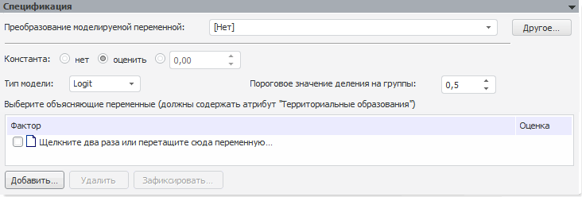

# Спецификация бинарной регрессии на панельных данных

Спецификация бинарной регрессии на панельных данных
-

# Спецификация

Панель спецификация для метода расчёта «Бинарная
 регрессия на панельных данных»:

	- [Преобразование
	 моделируемой переменной](../../UiModelling_work_Changes.htm). Определяется тип преобразования,
	 которое осуществляется над моделируемой переменной перед расчетом
	 модели. Выбранное преобразование применяется для каждого значения
	 атрибута/элемента измерения, по которому ведется расчет.

	- Константа. Переключатели
	 определяют режим задания константы для модели:

	-

		- Нет.
		 Установлено по умолчанию. Константа в модели не используется;

		- Оценить.
		 Значение константы будет оценено автоматически в процессе расчёта
		 модели. Полученное значение будет отображено в поле ввода справа;

		- Указание значения константы.
		 Значение константы задается пользователем в соответствующем поле,
		 которое доступно для ввода после установки данного переключателя;

	- Тип модели. Выбирается
	 модель для оценки переменных:

	-

		- Logit. Выбрана по
		 умолчанию. Рассматривается логистическое нормальное распределение;

		- Probit. Рассматривается
		 стандартное нормальное распределение;

	- Выберите объясняющие переменные.
	 Задаются объясняющие переменные (факторы), влияющие на объясняемую
	 переменную. Все факторы должны содержать атрибут/измерение, по которому
	 осуществляется расчёт модели. Для добавленных факторов в соответствующем
	 столбце отображается оцененное значение коэффициента. Данные значения
	 для факторов также отображаются на панели «[Идентифицированное
	 уравнение](../Standart_Model/identified_equation.htm)». Принципы работы с объясняющими переменными описаны
	 в разделе «[Работа
	 с входными переменными](../Standart_Model/UiModelling_Model_Factor_work.htm)».

Примечание.
 Число объясняющих рядов (m) должно
 удовлетворять неравенству: 0 < m
 < n-1 для модели с константой и формуле: 0
 < m < n для модели без константы, где n
 - число наблюдений в объясняемом ряде.

См. также:

[Модель
 на панельных данных](UiModelling_PooledModel_Main.htm) | [Объект «Модель»](../UiModelling_Model.htm)
 | Метод расчёта [бинарной
 регрессии](Lib.chm::/01_Regression_models/UiModelling_BinaryModel.htm)

		Справочная
		 система на версию 10.9
		 от 18/08/2025,
		 © ООО «ФОРСАЙТ»,
