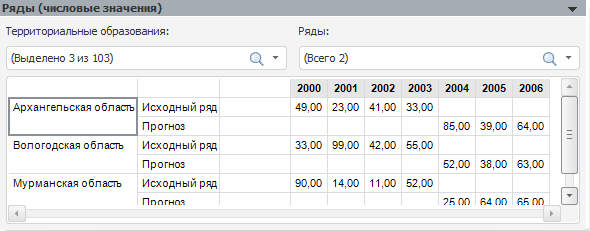

# Числовые значения рядов и объясняющих переменных

Числовые значения рядов и объясняющих переменных
-

# Числовые значения рядов и объясняющих переменных

Панели «Ряды (числовые значения)»
 и «Объясняющие переменные (числовые значения)»
 отображают таблицы, содержащие числовые значения, по которым строятся
 графики на панелях «[Графики и диаграммы
 (совмещённое представление)](UiModelling_Pooled_Diagr_common.htm#diagr_comm)» и «[Графики
 и диаграммы (по значениям атрибута)](UiModelling_Pooled_Diagr_common.htm#diagr_elem)».

## Ряды (числовые значения)

Из раскрывающегося списка выбираются значения атрибута/элементы измерения,
 по которому был произведен расчет. Атрибут/измерение выбран на панели
 «[Параметры](UiModelling_Pooled_Param.htm)».

Раскрывающийся список «Ряды»
 содержит список рядов, числовые данные которых могут быть отображены в
 таблице. По умолчанию выбран исходный ряд.

## Объясняющие переменные (числовые значения)

Данная панель выглядит аналогично панели «Ряды
 (числовые значения)». Отличие заключается в том, что в списке «Ряды» содержатся объясняющие переменные
 модели.

См. также:

[Модель
 на панельных данных](UiModelling_PooledModel_Main.htm) | [Модель](../UiModelling_Model.htm)

		Справочная
		 система на версию 10.9
		 от 18/08/2025,
		 © ООО «ФОРСАЙТ»,
