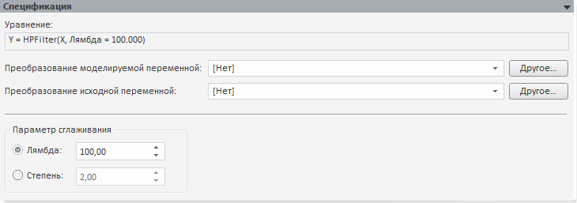

# Фильтр Ходрика-Прескотта (настольное приложение)

Фильтр Ходрика-Прескотта (настольное приложение)
-

# Фильтр Ходрика-Прескотта

Фильтр Ходрика-Прескотта - это метод сглаживания временного ряда, который
 используется для выделения длительных тенденций временного ряда.

Панель «Спецификация» для данного
 метода:

В строке «Уравнение» выводится
 уравнение модели, отражающее в сокращенном виде преобразование над моделируемой
 переменной и параметры метода.

[Для преобразования
 моделируемой/исходной переменной](javascript:TextPopup(this))

	По умолчанию над моделируемой/исходной переменной не выполняются
	 дополнительные преобразования перед расчетом модели.

	Для задания [дополнительного
	 преобразования](../../../UiModelling_work_Changes.htm) моделируемой/исходной переменной перед расчетом
	 модели используйте раскрывающий список «Преобразование
	 моделируемой/исходной переменной». По умолчанию преобразование
	 входной переменной совпадает с преобразованием моделируемой переменной.

[Для задания параметра сглаживания](javascript:TextPopup(this))

	Параметр сглаживания управляет мерой гладкости ряда. Чем больше
	 значение параметра, тем более гладким получается ряд. Если значение
	 параметра сглаживания стремится к бесконечности, то ряд превращается
	 в линейный тренд.

	Для задания параметра сглаживания используйте группу переключателей
	 «Параметр сглаживания»:

		- Лямбда. Параметр
		 сглаживания определяется значением лямбды. Значение по умолчанию
		 - «100»;

		- Степень. Параметр
		 сглаживания определяется значением степени, которое должно быть
		 больше нуля. Значение по умолчанию - «4».

См. также:

Метод «[Фильтр
 Ходрика-Прескотта](Lib.chm::/02_Time_series_analysis/UiModelling_HodrickPrescottFilter.htm)» | Анализ временных рядов: [Фильтр
 Ходрика-Прескотта](UiDw.chm::/Workbook/CalculatedSeries/Smoothing/UiDw_cs_HodrickPrescottFilter.htm) | [IModelling.Hpf](KeMs.chm::/Interface/IModelling/IModelling.Hpf.htm)
 | [IModelling.Hpfp](KeMs.chm::/Interface/IModelling/IModelling.Hpfp.htm)

		Справочная
		 система на версию 10.9
		 от 18/08/2025,
		 © ООО «ФОРСАЙТ»,
