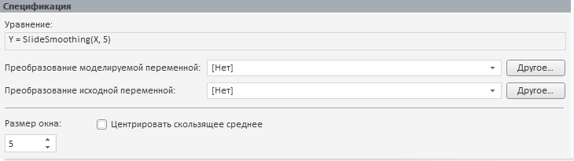

# Скользящее среднее

Скользящее среднее
-

# Скользящее среднее

Метод скользящего среднего основан на представлении ряда в виде суммы
 достаточно гладкого тренда и случайной компоненты.

Панель «Спецификация» для данного
 метода:

В строке «Уравнение» выводится
 уравнение модели, отражающее в сокращенном виде преобразование над моделируемой
 переменной и параметры метода.

[Для преобразования
 моделируемой/исходной переменной](javascript:TextPopup(this))

	По умолчанию над моделируемой/исходной переменной не выполняются
	 дополнительные преобразования перед расчетом модели.

	Для задания [дополнительного
	 преобразования](../../../UiModelling_work_Changes.htm) моделируемой/исходной переменной перед расчетом
	 модели используйте раскрывающий список «Преобразование
	 моделируемой/исходной переменной». По умолчанию преобразование
	 входной переменной совпадает с преобразованием моделируемой переменной.

[Для задания размера окна](javascript:TextPopup(this))

	Размер окна - это интервал времени, на котором будет определяться
	 среднее значение элементов. Чем больше размер окна, тем более «гладкий»
	 получается ряд.

	Для задания размера окна используйте поле «Размер
	 окна».

[Для центрирования
 скользящего среднего](javascript:TextPopup(this))

	Для использования метода центрирования при расчете сглаженных значений
	 установите флажок «Центрировать скользящее
	 среднее». Центрирование скользящего среднего актуально при
	 четном значении параметра «Размер
	 окна».

См. также:

[Метод
 скользящего среднего](Lib.chm::/02_Time_series_analysis/UiModelling_SlideSmooth.htm) | Анализ временных рядов: [Скользящее
 среднее](UiDw.chm::/Workbook/CalculatedSeries/Smoothing/UiDw_cs_MovingAverage.htm) | [IModelling.Movavg](KeMs.chm::/Interface/IModelling/IModelling.Movavg.htm)

		Справочная
		 система на версию 10.9
		 от 18/08/2025,
		 © ООО «ФОРСАЙТ»,
