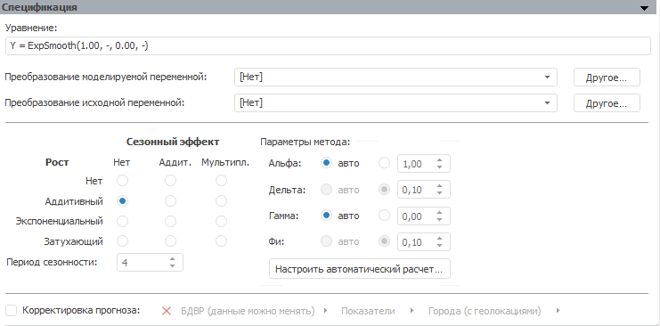

# Экспоненциальное сглаживание (настольное приложение)

Экспоненциальное сглаживание (настольное приложение)
-

# Экспоненциальное сглаживание

Экспоненциальное сглаживание является одним из наиболее распространенных
 приемов выравнивания и прогнозирования широкого класса временных рядов.
 В его основе лежит расчет экспоненциальных средних.

Панель «Спецификация» для данного
 метода:

В строке «Уравнение» выводится
 уравнение модели, отражающее в сокращенном виде преобразование над моделируемой
 переменной и параметры метода.

[Для преобразования
 моделируемой/исходной переменной](javascript:TextPopup(this))

	По умолчанию над моделируемой/исходной переменной не выполняются
	 дополнительные преобразования перед расчетом модели.

	Для задания [дополнительного
	 преобразования](../../../UiModelling_work_Changes.htm) моделируемой/исходной переменной перед расчетом
	 модели используйте раскрывающий список «Преобразование
	 моделируемой/исходной переменной». По умолчанию преобразование
	 входной переменной совпадает с преобразованием моделируемой переменной.

[Для задания
 сезонного эффекта](javascript:TextPopup(this))

	Данный метод подразумевает выделение сезонной составляющей, когда
	 в исходном ряде наблюдаются достаточно постоянные периодические отклонения
	 в абсолютном выражении от варьирующего во времени среднего уровня
	 ряда с заранее известным периодом. Для отражения [сезонной
	 особенности](Lib.chm::/02_Time_series_analysis/UiModelling_ExpSmooth_season.htm) в модели используется параметр «Дельта».

	Временной ряд разлагают на систематическую (d) и случайную составляющие
	 (e). Для выбора модели сезонности используйте группу переключателей
	 «Сезонный эффект»:

		- Нет;

		- Аддитивная: ŷ = d + e;

		- Мультипликативная: ŷ = de.

[Для задания
 модели роста](javascript:TextPopup(this))

	Временные ряды часто имеют тенденцию некоторого роста или убывания.
	 В этом случае модель экспоненциального сглаживания использует коэффициент,
	 учитывающий [рост](Lib.chm::/02_Time_series_analysis/UiModelling_ExpSmooth_growthhtm.htm)
	 - «Гамма».

	Для задания модели роста используйте группу переключателей «Рост»:

		- Нет;

		- Аддитивный;

		- Экспоненциальный;

		- Затухающий.

[Для задания
 периода сезонности](javascript:TextPopup(this))

	Задавать длину периода сезонности требуется, если выбран какой-либо
	 сезонный эффект.

	Для задания длины периода сезонности используйте поле «Период
	 сезонности».

[Для задания
 параметров метода](javascript:TextPopup(this))

	Параметры метода - это набор коэффициентов: «Альфа»,
	 «Дельта», «Гамма»,
	 «Фи».

	Для работы с коэффициентами используйте группу параметров «Параметры метода». Набор коэффициентов
	 зависит от выбранных параметров роста и сезонного эффекта. Если установлен
	 переключатель «авто», то коэффициент
	 оценивается автоматически по заданным параметрам, иначе значение коэффициента
	 задается вручную в соответствующем редакторе чисел.

	Для настройки параметров автоматической оценки коэффициентов нажмите
	 кнопку «[Настроить автоматический
	 расчёт](uimodelling_model_specification_exponential_param.htm)». Будет открыт диалог, в котором задайте необходимые параметры.

[Для корректировки
 прогноза](javascript:TextPopup(this))

		- Установите флажок «Корректировка
		 прогноза».

		- Задайте переменную, которая будет использоваться для корректировки
		 прогноза. Данная переменная не включаются в идентифицированное
		 уравнение модели.

	В модели будет применяться корректировка прогноза.

	При работе моделирования и прогнозирования в [режиме
	 на переменных](../../../../../1_Modelling/Start_Modelling.htm) учитывайте следующие особенности:

		- при выборе переменной, количество измерений которой не совпадает
		 с количеством измерений моделируемой переменной, будет открыт
		 диалог «[Изменение размерности](../../../UiModelling_ChangeDimension.htm)».
		 В данном диалоге выполните фиксацию по измерениям, отсутствующим
		 у моделируемой переменной;

		- доступны следующие кнопки для работы с переменной корректировки
		 прогноза:

			- Создать. Создает
			 переменную (без данных), используемую для корректировки прогноза. Динамика
			 переменной соответствует динамике модели. Созданная переменная
			 располагается в корне контейнера моделирования, имеет наименование
			 «Фактор корректировки прогноза»
			 и автоматически будет открыта для редактирования;

			- Зафиксировать.
			 Осуществляет фиксацию переменной. Открывает диалог «[Изменение размерности](../../../UiModelling_ChangeDimension.htm)». Если
			 размерности фактора корректировки прогноза и моделируемой
			 переменной совпадают, то кнопка недоступна.

См. также:

Метод [экспоненциального
 сглаживания](Lib.chm::/02_Time_series_analysis/UiModelling_ExpSmooth.htm) | Анализ временных рядов: [Экспоненциальное
 сглаживание](UiDw.chm::/Workbook/CalculatedSeries/Forecast/UiDw_cs_ExponentialSmoothing.htm) | [IModelling.Expsmooth](KeMs.chm::/Interface/IModelling/IModelling.Expsmooth.htm)

		Справочная
		 система на версию 10.9
		 от 18/08/2025,
		 © ООО «ФОРСАЙТ»,
