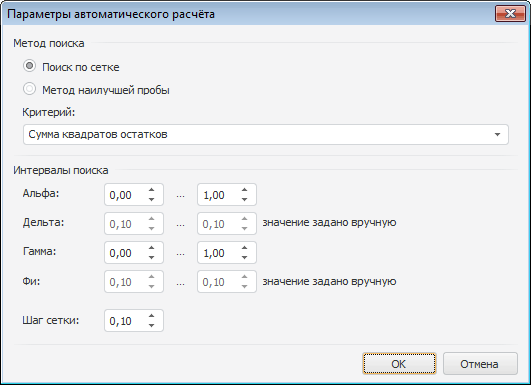
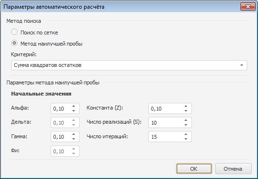

# Параметры автоматического расчёта

Параметры автоматического расчёта
-

# Параметры автоматического расчёта

Параметры автоматического расчёта задаются в одноименном диалоге.

[Для открытия диалога](javascript:TextPopup(this))

		- Откройте модель [экспоненциального
		 сглаживания](uimodelling_model_specification_exponential.htm).

		- Перейдите на панель «Спецификация».

		- Нажмите кнопку «Настроить
		 автоматический расчёт».

Диалог состоит из двух групп: «Метод
 поиска» и группы, вид и наименование которой зависят от выбранного
 метода поиска коэффициентов.

Группа «Метод поиска» содержит:

	- переключатели для задания метода поиска:

	-

		- поиск по сетке;

		- метод наилучшей пробы;

	- раскрывающийся список, задающий критерий
	 поиска. Возможные критерии:

	-

		- сумма квадратов отклонений прогнозных значений на каждую
		 точку идентификации;

		- модуль среднего остатков;

		- среднее модулей остатков;

		- сумма квадратов остатков.

## Поиск по сетке

Параметры автоматического расчета, если используется метод поиска «Поиск по сетке»:

Группа «Интервалы поиска» определяет,
 в каких пределах искать значения коэффициентов «Альфа», «Дельта», «Гамма», «Фи». В соответствующих редакторах
 чисел задайте интервал поиска, учитывая ограничения:

	- для нижней границы (первый редактор чисел) минимальное значение
	 - нуль, максимальное - единица;

	- для верхней границы (второй редактор чисел) минимальное значение
	 - значение нижней границы, максимальное - единица.

Доступность интервалов поиска значений коэффициентов зависит от сезонного
 эффекта и модели роста. Если значение коэффициента было установлено вручную,
 то редактирование интервала недоступно, а в соответствующем редакторе
 выведено заданное значение. Также добавлено примечание: «значение
 задано вручную».

Параметр «Шаг сетки» определяет
 величину интервала, с которым выполняется поиск по сетке.

## Метод наилучшей пробы

Параметры автоматического расчета, если используется метод поиска «Метод наилучшей пробы»:

Группа «Параметры метода наилучшей
 пробы» определяет:

	- Начальные значения.
	 В соответствующих редакторах чисел задайте начальные значения для
	 поиска значений коэффициентов «Альфа», «Дельта», «Гамма», «Фи». Доступность редакторов зависит
	 от сезонного эффекта и роста модели. Если значение коэффициента было
	 задано вручную, то редактирование также недоступно.

	- Константа (Z). Вещественное
	 значение константы, используемое для метода наилучшей пробы;

	- Число реализаций (S).
	 Число реализаций коэффициента;

	- Число итераций. Максимальное
	 число итераций, за которое должно быть получено значение.

См. также:

[Экспоненциальное
 сглаживание](uimodelling_model_specification_exponential.htm)

		Справочная
		 система на версию 10.9
		 от 18/08/2025,
		 © ООО «ФОРСАЙТ»,
