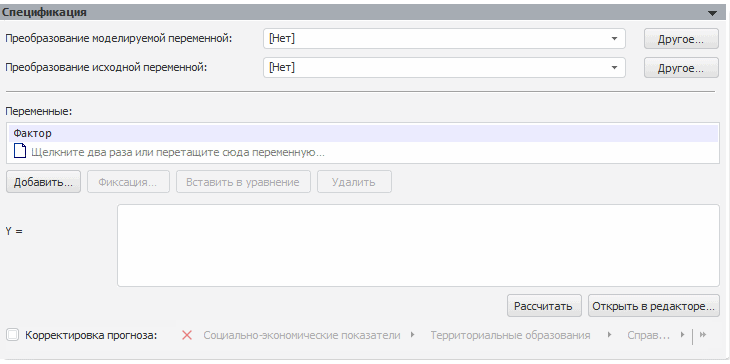

# Нелинейная регрессия: оценка нелинейным МНК (настольное приложение)

Нелинейная регрессия: оценка нелинейным МНК (настольное приложение)
-

# Нелинейная регрессия (оценка нелинейным МНК)

Данный метод позволяет осуществлять нелинейные преобразования данных.

Панель «Спецификация» для данного
 метода:

[Для преобразования
 моделируемой/исходной переменной](javascript:TextPopup(this))

	По умолчанию над моделируемой/исходной переменной не выполняются
	 дополнительные преобразования перед расчетом модели.

	Для задания [дополнительного
	 преобразования](../../../UiModelling_work_Changes.htm) моделируемой/исходной переменной перед расчетом
	 модели используйте раскрывающий список «Преобразование
	 моделируемой/исходной переменной». По умолчанию преобразование
	 входной переменной совпадает с преобразованием моделируемой переменной.

[Для задания
 переменных](javascript:TextPopup(this))

	Для задания набора объясняющих переменных (факторов), влияющих на
	 моделируемую переменную, используйте список «Факторы».
	 Каждой переменной ставится в соответствие элемент с идентификатором
	 вида Xn, где n
	 - номер по порядку. Данные элементы используются при составлении
	 уравнения.

	Основные принцип работы с факторами приведены в разделе «[Работа
	 с факторами (входными переменными)](../../Standart_Model/UiModelling_Model_Factor_work.htm)».

[Для изменения
 динамики переменных](javascript:TextPopup(this))

	В модели доступно задание произвольной динамики переменных. Для
	 этого в контекстном меню переменной выберите пункт «Динамика»
	 и в отобразившемся подменю укажите требуемую динамику. По умолчанию
	 динамика переменной совпадает с динамикой модели.

	Для использования переменной динамики модели в контекстном меню
	 переменной выберите пункт «Динамика»
	 и в отобразившемся подменю установите переключатель «Динамика
	 модели».

	Примечание.
	 Изменение динамики доступно только для переменных, источник данных
	 которых содержит календарное измерение.

[Для использования
 переменной в уравнении](javascript:TextPopup(this))

		- Выделите переменную и нажмите кнопку «Вставить
		 в уравнение».

		- Выполните команду «Вставить
		 в уравнение» в контекстном меню переменной.

		- Перетащите переменную из списка «Факторы».

		- Введите идентификатор элемента, соответствующего переменной,
		 с клавиатуры.

	Элемент, соответствующий выбранной переменной, будет вставлен в
	 уравнение.

[Для составления уравнения модели](javascript:TextPopup(this))

	Для составления уравнения модели используйте поле «Y=». В
	 данном поле формируется уравнение преобразования данных. Все элементы,
	 соответствующие переменным, в уравнении отображаются в виде гиперссылок.
	 При наведении курсора мыши на гиперссылку отображается подсказка с
	 наименованием переменной, которая ей соответствует. В уравнении можно
	 использовать любые арифметические операции, круглые скобки, допускается
	 использование статистических, математических и пользовательских функций/методов.

	Для редактирования уравнения нажмите кнопку «Открыть
	 в редакторе». В открывшемся окне «[Редактор
	 выражения](UiNav.Chm::/GUI/ExpressionEditor.htm)» внесите требуемые изменения.

	Примечание.
	 Наименование поля «Y=» будет
	 изменено в зависимости от преобразования, настроенного для моделируемой
	 переменной. Например, если выбрано преобразование «Натуральный
	 логарифм», то поле будет иметь название «Log(Y)=».

[Для корректировки
 прогноза](javascript:TextPopup(this))

		- Установите флажок «Корректировка
		 прогноза».

		- Задайте переменную, которая будет использоваться для корректировки
		 прогноза. Данная переменная не включаются в идентифицированное
		 уравнение модели.

	В модели будет применяться корректировка прогноза.

	При работе моделирования и прогнозирования в [режиме
	 на переменных](../../../../../1_Modelling/Start_Modelling.htm) учитывайте следующие особенности:

		- при выборе переменной, количество измерений которой не совпадает
		 с количеством измерений моделируемой переменной, будет открыт
		 диалог «[Изменение размерности](../../../UiModelling_ChangeDimension.htm)».
		 В данном диалоге выполните фиксацию по измерениям, отсутствующим
		 у моделируемой переменной;

		- доступны следующие кнопки для работы с переменной корректировки
		 прогноза:

			- Создать. Создает
			 переменную (без данных), используемую для корректировки прогноза. Динамика
			 переменной соответствует динамике модели. Созданная переменная
			 располагается в корне контейнера моделирования, имеет наименование
			 «Фактор корректировки прогноза»
			 и автоматически будет открыта для редактирования;

			- Зафиксировать.
			 Осуществляет фиксацию переменной. Открывает диалог «[Изменение размерности](../../../UiModelling_ChangeDimension.htm)». Если
			 размерности фактора корректировки прогноза и моделируемой
			 переменной совпадают, то кнопка недоступна.

[Для расчета
 модели](javascript:TextPopup(this))

	Для расчета модели по заданному уравнению нажмите кнопку «Рассчитать». Если при расчете возникнут
	 ошибки или предупреждения, то они будут отображены на вкладках «[Ошибки](../../Standart_Model/UiModelling_Model_Error.htm)» и «[Предупреждения](../../Standart_Model/UiModelling_Model_Warning.htm)»
	 соответственно.

	Примеры ситуаций, в которых модель не может быть рассчитана:

		- если в уравнении содержатся ошибки (недопустимые знаки операций,
		 указан несуществующий элемент и так далее), то будет отображено
		 соответствующее сообщение, содержащее номер позиции с ошибкой.
		 После закрытия сообщения курсор будет перемещен в указанную позицию
		 уравнения;

		- если уравнение не может быть рассчитано хотя бы в одной
		 точке.

См. также:

[Работа
 с входными переменными](../../Standart_Model/UiModelling_Model_Factor_work.htm) | Метод расчета [нелинейной
 регрессии](Lib.chm::/01_Regression_models/UiModelling_NonLinearRegr.htm) | Анализ временных рядов: [Нелинейная
 регрессия](UiDw.chm::/Workbook/CalculatedSeries/Regression/UiDw_cs_NonLinearRegression.htm)

		Справочная
		 система на версию 10.9
		 от 18/08/2025,
		 © ООО «ФОРСАЙТ»,
