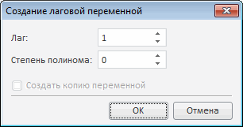

# Редактирование лаговой переменной

Редактирование лаговой переменной
-

# Редактирование лаговой переменной

Если регрессор преобразуется в лаговую переменную, то отображается диалог:

В диалоге задаётся лаг (по умолчанию он равен лагу преобразуемого регрессора)
 и степень полинома.

При установке флажка «Создать копию
 переменной» преобразуемый регрессор останется в модели, а лаговая
 переменная будет создана дополнительно.

См. также:

[Линейная регрессия
 (оценка МНК)](uimodelling_model_specification_linaer_reg.htm) | [Модель
 распределенных лагов](Lib.chm::/02_Time_series_analysis/UiModelling_Polinimial_Distributed_Lags.htm)

		Справочная
		 система на версию 10.9
		 от 18/08/2025,
		 © ООО «ФОРСАЙТ»,
