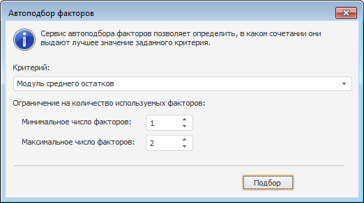

# Автоподбор факторов

Автоподбор факторов
-

# Автоподбор факторов

Для автоподбора факторов линейной регрессии нажмите кнопку «Автоподбор»
 на панели «[Спецификация](uimodelling_model_specification_linaer_reg.htm)».
 Будет открыто окно:

	- Критерий. Выбирается
	 критерий, по которому будет подбираться набор факторов:

	-

		- модуль среднего остатков;

		- среднее модулей остатков;

		- сумма квадратов остатков;

		- [коэффициент
		 детерминации](Lib.chm::/05_Statistics/UiModellind_DetermCoeff_R2.htm);

		- [скорректированный
		 коэффициент детерминации](Lib.chm::/05_Statistics/UiModellind_DetermCoeff_AdjR2.htm).

	- Ограничение на количество используемых
	 факторов. Допустимое количество используемых факторов укажите
	 в полях «Минимальное число факторов»
	 и «Максимальное число факторов».

После окончания процесса подбора в списке «Факторы»
 (на панели «[Спецификация](uimodelling_model_specification_linaer_reg.htm)»)
 будут отмечены флажками те факторы, которые обеспечивают лучшее значение
 заданного критерия.

См. также:

[Линейная регрессия](uimodelling_model_specification_linaer_reg.htm)

		Справочная
		 система на версию 10.9
		 от 18/08/2025,
		 © ООО «ФОРСАЙТ»,
