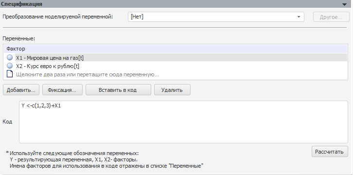

# R

R
-

# R

Модель позволяет выполнять преобразование данных с помощью методов пакета
 R.

Примечание.
 Методы R доступны, если в «Форсайт. Аналитическая платформа»
 подключен пакет R. Подробнее см. раздел: «[Как
 настроить интеграцию с R?](../../../../FAQ/R_Integration.htm)».

Панель «Спецификация» для данной
 модели:

[Для преобразования
 моделируемой переменной](javascript:TextPopup(this))

	По умолчанию над моделируемой переменной не выполняются ни какие
	 дополнительные преобразования перед расчетом модели.

	Для задания [дополнительного
	 преобразования](../../UiModelling_work_Changes.htm) моделируемой переменной перед расчетом модели используйте
	 раскрывающий список «Преобразование
	 моделируемой переменной».

[Для задания
 переменных](javascript:TextPopup(this))

	Для задания набора объясняющих переменных (факторов), влияющих на
	 моделируемую переменную, используйте список «Факторы».
	 Каждой переменной ставится в соответствие элемент с идентификатором
	 вида Xn, где n
	 - номер по порядку. Данные элементы используются при составлении
	 уравнения.

	Основные принцип работы с факторами приведены в разделе «[Работа
	 с факторами (входными переменными)](../Standart_Model/UiModelling_Model_Factor_work.htm)».

[Для задания кода модели](javascript:TextPopup(this))

	Для составления кода модели используйте поле «Код».
	 Сформируйте выражение для преобразования данных. Для формирования
	 выражения используйте язык R. Более подробное описание об языке R
	 приведено в [документации
	 к R](http://cran.r-project.org/manuals.html).

	Для использования переменных в коде:

		- выделите переменную в списке «Переменные»
		 и нажмите кнопку «Вставить
		 в код»;

		- с клавиатуры введите идентификатор элемента.

[Для расчета модели](javascript:TextPopup(this))

	Для расчета модели по заданному коду нажмите кнопку «Рассчитать».
	 Если при расчете возникнут ошибки или предупреждения, то они будут
	 отображены на вкладках «[Ошибки](../Standart_Model/UiModelling_Model_Error.htm)»
	 и «[Предупреждения](../Standart_Model/UiModelling_Model_Warning.htm)»
	 соответственно.

См. также:

[Спецификация](UiModelling_Model_Specification.htm)

		Справочная
		 система на версию 10.9
		 от 18/08/2025,
		 © ООО «ФОРСАЙТ»,
