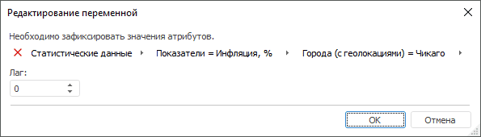
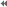
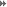

# Редактирование переменной

Редактирование переменной
-

# Редактирование переменной

В окне «Редактирование переменной»
 задаются значения атрибутов переменной и лаг:

В поле для выбора переменной содержится кнопка с наименованием источника
 данных и все атрибуты данного источника, необходимые для однозначного
 определения переменной. Наименования переменных отображаются в следующем
 формате: Наименование источника данных
 переменной > Атрибут 1 = Значение атрибута 1 > Атрибут
 n = Значение атрибута n. Наименование источника данных
 переменной приводится после кнопки .

Примечание.
 Если источник данных переменной не содержит календарного измерения, то
 переменная будет рассматриваться как константа.

Если справочник единиц измерения не входит в уникальный ключ базы данных
 временных рядов, являющейся источником данных переменной, то используемые
 единицы измерения отображаются серым курсивом в полях моделируемой и исходной
 переменных.

[Для
 выбора переменной](javascript:TextPopup(this))

	Задайте значения всех атрибутов источника данных. Выбор значения
	 атрибута производится из раскрывающегося списка, который вызывается
	 щелчком мыши по атрибуту. В списке доступна только единичная отметка.

	Если не все атрибуты помещаются на панели, то отображаются кнопки
	  и 
	 для перемещения между атрибутами.

[Для
 использования параметров в качестве значений атрибутов](javascript:TextPopup(this))

	Если модель содержит параметры или входит в метамодель, содержащую
	 [параметры](../../2_3_3_MetaModel/Metamodel_params.htm),
	 то в качестве значения атрибута можно указать параметр метамодели.

	Примечание.
	 Параметры модели можно создать с помощью языка [Fore](KeTransform.chm::/Interface/ITsModelParam/ITsModelParam.htm).

	Подробное описание работы с параметрами приведено в разделе «[Использование
	 параметров модели](../Standart_Model/UiModelling_Panel_Param_Attr.htm#params)».

[Для
 настройки агрегации значений атрибутов переменной](javascript:TextPopup(this))

	- Вызовите контекстное меню атрибута.

	- В группе «Агрегация»
	 выберите один из доступных методов агрегации.

	- Для расчета агрегации с учетом иерархии значений атрибута установите
	 переключатель «По иерархии».
	 По умолчанию флажок снят и расчет агрегации выполняется без учета
	 иерархии.

	- Для расчета агрегации только по тем значениям атрибута, которые
	 соответствуют определенным условиям, выполните команду «Расширенная
	 фильтрация». Будет отображен диалог «Расширенный
	 фильтр», в котором задайте требуемые условия. Порядок работы
	 с данным диалогом приведен в разделе «[Настройка фильтрации по значениям атрибутов](uinav.chm::/GUI/UFE/AttributeFiltering.htm)».

	- После закрытия контекстного меню атрибута щелкните по нему и
	 в отобразившемся списке значений выберите агрегируемые. Доступна множественная
	 отметка. Если ни одно значение не выбрано, то агрегация рассчитывается
	 по всем значениям.

В результате будет настроена агрегация значений атрибутов переменной.
 Для сброса агрегации выберите значение «Нет»
 в группе «Агрегация» в контекстном
 меню атрибута.

[Для
 изменения источника данных переменной](javascript:TextPopup(this))

		- Нажмите кнопку с наименованием источника данных переменной.
		 Будет отображен список с доступными источниками данных.

		- Выберите требуемый источник. Для выбора доступны стандартные
		 кубы, виртуальные кубы и базы данных временных рядов. Набор атрибутов
		 в выбранном источнике должен совпадать с набором атрибутов [моделируемой
		 переменной](../Standart_Model/UiModelling_Panel_Param_Attr.htm).

	Для переменной будет использоваться новый источник данных.

	Примечание.
	 С помощью внутреннего языка Fore в качестве источника данных можно
	 использовать представление-куб.

[Для
 сброса переменной](javascript:TextPopup(this))

	Нажмите кнопку , расположенную
	 в поле выбора переменной/вида модели. Все значения атрибутов переменной
	 будут сброшены.

[Для
 задания лага переменной](javascript:TextPopup(this))

	Лаг отвечает за сдвиг данных переменной вперед на заданное количество
	 точек во временном периоде. Для указания значения лага используйте
	 поле «Лаг».

	Примечание.
	 Задание лага доступно только для переменных, источник данных которых
	 содержит календарное измерение.

См. также:

[Объект «Модель»](../UiModelling_Model.htm)

		Справочная
		 система на версию 10.9
		 от 18/08/2025,
		 © ООО «ФОРСАЙТ»,
