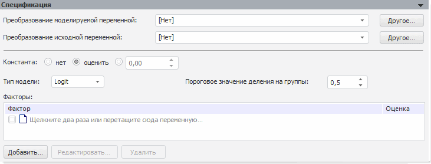

# Спецификация (настольное приложение)

Спецификация (настольное приложение)
-

# Спецификация

Панель «Спецификация» отображается
 после выбора вида модели на панели «[Параметры](../Standart_Model/UiModelling_Panel_Param_Attr.htm)».

В спецификации задаются индивидуальные для каждого метода параметры
 расчёта. Вид данной панели для каждой модели различен.

Пример спецификации для модели «[Модель
 бинарного выбора (оценка методом максимального правдоподобия)](Binary_regression/UiModelling_Spec_Binary_regression.htm)»:

Доступные модели:

[Регрессионные
 модели](javascript:TextPopup(this))

		- Модель множественной регрессии:

			- [Линейная
			 регрессия (оценка МНК)](8_Linear_regression/uimodelling_model_specification_linaer_reg.htm);

			- [Линейная
			 регрессия (оценка методом инструментальных переменных)](8_Linear_regression/uimodelling_model_specification_linaer_reg2.htm).

		- [Модель
		 бинарного выбора (оценка методом максимального правдоподобия)](Binary_regression/UiModelling_Spec_Binary_regression.htm).

		- [Нелинейная
		 регрессия (оценка нелинейным МНК)](7_Nonlinear_regression/7_nonlinear_regression.htm).

[Анализ временных
 рядов](javascript:TextPopup(this))

		- [Тренд с подбором
		 функциональной зависимости](9_Universal_graph/9_universal_graph.htm).

		- Методы сглаживания:

			- [Медианное
			 сглаживание](6_Median_smoothing/6_median_smoothing.htm);

			- [Скользящее
			 среднее](2_Slitherring_smoothing/2_Slitherring_smoothing.htm);

			- [Грей-метод](UiModelling_Specification_GrayForecast.htm);

			- [Фильтр
			 Ходрика-Прескотта](10_Filter_Hodrika_Preskotta/10_filter_hordrika_preskotta.htm);

			- [LRX-фильтр](UiModelling_Specification_LRX.htm);

			- [Фильтр
			 Бакстера-Кинга](UiModelling_Specification_BaxterKingFilter.htm);

			- [Экспоненциальное
			 сглаживание](5_Exponential_smoothing/uimodelling_model_specification_exponential.htm);

			- [X11](UiModelling_Specification_Census2.htm).

		- [ARIMA](1_Arima/uimodelling_model_specification_arima.htm).

		- Динамические модели:

			- [Модель
			 коррекции ошибок](UiModelling_Specification_Error_control.htm).

[Преобразования](javascript:TextPopup(this))

		- [Агрегация](aggregation/aggregation.htm).

		- Агрегация для моделей на атрибутах:

			- [Агрегация
			 (базовая)](aggregation/UiModelling_Aggregation_Attr.htm);

			- [Агрегация
			 (расширенная)](aggregation/UiModelling_Aggregation_Attr_CrossDim.htm).

		- [Методы
		 накопления](UiModelling_Specification_Cumulative.htm).

		- [Коллапс
		 (векторный расчет)](UiModelling_Specification_Collaps.htm).

		- [Коллапс
		 (поточечный расчет)](UiModelling_Specification_Collaps_point.htm).

		- [Заполнение
		 пропусков](UiModelling_Specification_Working_Lost.htm).

		- [Интерполяция](UiModelling_Specification_Interpolation.htm).

[Прочие
 модели](javascript:TextPopup(this))

		- [Детерминированное
		 уравнение](4_Deterministic_equation/uimodelling_model_specification_deter.htm).

		- [R](R.htm). Подробная информация об особенностях
		 работы методов R приведена в разделе: «[Какие методы в «Форсайт. Аналитическая платформа»
		 можно рассчитать с помощью R?](uinav.chm::/FAQ/Use_of_R.htm)».

		- [Пользовательские
		 методы](UiModelling_SpecificationUserMethod.htm).

См. также:

[Объект «Модель»](../UiModelling_Model.htm)

		Справочная
		 система на версию 10.9
		 от 18/08/2025,
		 © ООО «ФОРСАЙТ»,
