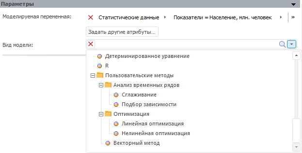
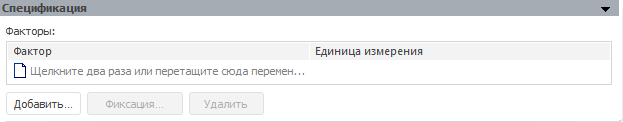
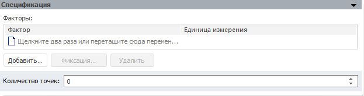

# Пользовательские методы: Моделирование и прогнозирование

Пользовательские методы: Моделирование и прогнозирование
-

# Пользовательские методы

Пользовательские функции и методы позволяют расширить возможности моделирования
 и прогнозирования за счёт использования пользовательских методик расчёта.

По умолчанию пользовательские функции не подключены к инструменту «Моделирование и прогнозирование».
 Для подключения пользовательских функций:

	- создайте [шаблон
	 пользовательского метода](../../../2_1_Create_Cont_Modeling/UiMd_Container_Modelling_Master_templateProperty.htm);

	- используйте вкладку «Методы»
	 в разделе «Пользовательские метаданные»
	 диалога «Параметры». Для получения
	 подробной информации обратитесь к статье «[Подключение пользовательских
	 функций](UiNav.chm::/GUI/ExpressionEditor_UserFunc.htm)».

Примечание.
 Подключение пользовательских функций доступно только в настольном приложении.

Подключенные пользовательские функции будут отображаться в разделе «Пользовательские методы» в раскрывающемся
 списке «Вид модели» на вкладке
 «Параметры», например:

Если для функции задана категория, то она также будет отображена в списке.

После выбора функции будет отображена панель «Спецификация».
 Если функция параметрическая, то на панели будут содержаться поля для
 ввода значений параметров функции, например:

	Простая функция Параметрическая функция

		

		

Задайте набор факторов (входных переменных), влияющих на моделируемую
 переменную, с помощью таблицы «Факторы».
 Основные принципы работы с факторами приведены в разделе «[Работа
 с факторами (входными переменными)](../Standart_Model/UiModelling_Model_Factor_work.htm)».

Для параметрической функции задайте значения её параметров.

См. также:

[Спецификация](UiModelling_Model_Specification.htm)

		Справочная
		 система на версию 10.9
		 от 18/08/2025,
		 © ООО «ФОРСАЙТ»,
