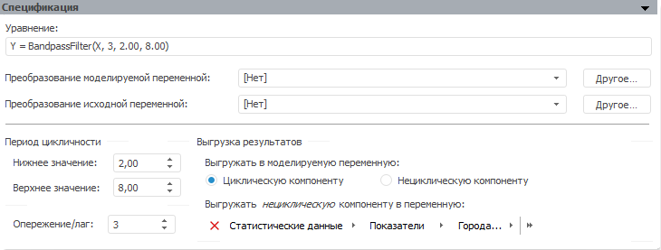

# Фильтр Бакстера-Кинга (настольное приложение)

Фильтр Бакстера-Кинга (настольное приложение)
-

# Фильтр Бакстера-Кинга

Фильтр Бакстера-Кинга - метод сглаживания временного ряда, который является
 модификацией [фильтра
 Ходрика-Прескотта](10_Filter_Hodrika_Preskotta/10_filter_hordrika_preskotta.htm) с более широкими возможностями исключения циклической
 составляющей во временном ряде.

Панель «Спецификация» метода:

В строке «Уравнение» выводится
 уравнение модели, отражающее в сокращенном виде преобразование над моделируемой
 переменной и параметры метода.

[Для преобразования
 моделируемой/исходной переменной](javascript:TextPopup(this))

	По умолчанию над моделируемой/исходной переменной не выполняются
	 дополнительные преобразования перед расчетом модели.

	Для задания [дополнительного
	 преобразования](../../UiModelling_work_Changes.htm) моделируемой/исходной переменной перед расчетом
	 модели используйте раскрывающий список «Преобразование
	 моделируемой/исходной переменной». По умолчанию преобразование
	 входной переменной совпадает с преобразованием моделируемой переменной.

[Для задания
 периода цикличности](javascript:TextPopup(this))

	Используйте группу параметров «Период
	 цикличности» и укажите значения верхней и нижней границ периода
	 цикличности.

	Значения границ периода цикличности устанавливаются в зависимости
	 от календарной динамики ряда. Значения по умолчанию:

			 Динамика
			 Нижняя граница
			 Верхняя граница

			 Годовая
			 2
			 8

			 Полугодовая
			 3
			 16

			 Квартальная
			 6
			 32

			 Месячная
			 18
			 96

			 Недельная
			 78
			 416

			 5-дневная
			 391,5
			 2088

			 7-дневная
			 547,5
			 2920

[Для задания
 опережения/лага](javascript:TextPopup(this))

	Используйте поле «Опережение/лаг»
	 и задайте размер интервала, на котором рассчитывается скользящее среднее.

	Значение опережения/лага устанавливаются в зависимости от календарной
	 динамики ряда. Значения по умолчанию:

			 Динамика
			 Опережение/лаг

			 Годовая
			 3

			 Полугодовая
			 6

			 Квартальная
			 12

			 Месячная
			 36

			 Недельная
			 156

			 5-дневная
			 783

			 7-дневная
			 1095

[Для задания
 параметров выгрузки результатов](javascript:TextPopup(this))

	Используйте группу параметров «Выгрузка
	 результатов». Задайте переменные, в которые будут выгружены
	 компоненты, рассчитанные методом.

	Для задания компоненты, значения которой будут выгружены в моделируемую
	 переменную после расчёта модели, используйте группу переключателей
	 «Выгружать в моделируемую переменную».
	 По умолчанию в моделируемую переменную выгружается циклическая компонента.

	Для задания переменной, в которую будет выгружена компонента, противоположная
	 компоненте, выгружаемой в моделируемую переменную, используйте поле
	 «Выгружать нециклическую/циклическую
	 компоненту в переменную».

	Примечание.
	 С помощью языка [Fore](KeMs.chm::/Interface/IMsBandpassFilterTransform/IMsBandpassFilterTransform.htm) доступна
	 выгрузка одной и той же компоненты и в моделируемую, и в дополнительную
	 переменную. В данном случае будет отображаться два поля: «Выгружать
	 циклическую компоненту в переменную» и «Выгружать
	 нециклическую компоненту в переменную».

	Если моделирование и прогнозирование работает в [режиме
	 на переменных](../../../../1_Modelling/Start_Modelling.htm) и количество измерений выбранной переменной не совпадает
	 с количеством измерений моделируемой переменной, то будет открыт диалог
	 «[Изменение
	 размерности](../../UiModelling_ChangeDimension.htm)», в котором необходимо произвести фиксацию по измерениям,
	 отсутствующим у моделируемой переменной. Для редактирования параметров
	 фиксации нажмите кнопку «Зафиксировать».
	 Кнопка недоступна, если размерности указанной переменной и моделируемой
	 переменной совпадают.

См. также:

[Спецификация](UiModelling_Model_Specification.htm)
 | Метод «[Фильтр
 Бакстера-Кинга](Lib.chm::/02_Time_series_analysis/UiModelling_BaxterKingFilter.htm)» | Анализ временных рядов: [Фильтр
 Бакстера-Кинга](UiDw.chm::/Workbook/CalculatedSeries/Smoothing/UiDw_cs_BandpassFilter.htm) | [IModelling.Bpf](KeMs.chm::/Interface/IModelling/IModelling.Bpf.htm)

		Справочная
		 система на версию 10.9
		 от 18/08/2025,
		 © ООО «ФОРСАЙТ»,
